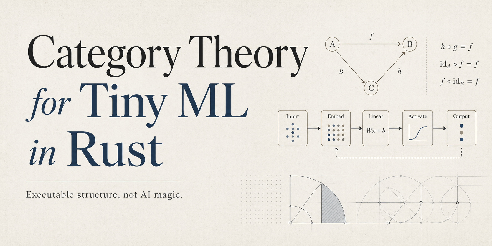
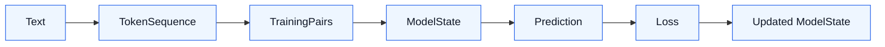

<p align="center">
  
</p>

# Category Theory for Tiny ML in Rust

> Tiny ML, Rust types, and category theory: executable structure, not AI magic.

Python made AI accessible.
Rust can make parts of AI understandable.

This is a first-principles, compile-checked tutorial for engineers who want to
understand the structure underneath machine-learning systems.

**Status:** public working draft. The current book and Rust examples are useful
and publishable now, but this is not the completed textbook yet. Completion
will continue through reader reports, source-backed rewrites, and later
validated editions.

```bash
cargo run --bin category_ml
```

Read the public draft, run the examples, and star the repo if you want more
executable AI education in Rust.

- Public book: <https://hghalebi.github.io/category_theory_transformer_rs/>
- First-session guide: [START_HERE.md](START_HERE.md)
- Reviewers needed: [REVIEWERS.md](REVIEWERS.md)
- Review worksheet: [docs/review-worksheet.md](docs/review-worksheet.md)
- Review guide: [docs/review-path.md](docs/review-path.md)
- Public review sprint: [docs/review-sprint.md](docs/review-sprint.md)
- Example review reports: [docs/review-examples.md](docs/review-examples.md)
- Project FAQ: [docs/faq.md](docs/faq.md)
- Term glossary: [docs/glossary.md](docs/glossary.md)
- Citation, reuse, and support terms: [LICENSE.md](LICENSE.md)
- Quick reader report: <https://github.com/hghalebi/category_theory_transformer_rs/issues/new?template=quick-reader-report.yml>
- Chapter clarity feedback: <https://github.com/hghalebi/category_theory_transformer_rs/issues/new?template=chapter-clarity.yml>

## Choose your path

| If you have... | Start here | Goal |
| --- | --- | --- |
| 5 minutes | `cargo run --example 01_token_sequence` | See text become typed training structure |
| 30 minutes | [START_HERE.md](START_HERE.md), then examples 01-03 | Learn the core path through the repo |
| You are new to one piece | [docs/beginner-path.md](docs/beginner-path.md) | Get unstuck across Rust, ML, and category words |
| You know Rust | [docs/rust-path.md](docs/rust-path.md) | Trace how types, traits, and tests protect ML meaning |
| You know ML frameworks | [docs/ml-path.md](docs/ml-path.md) | Map framework habits to tiny explicit Rust objects |
| You want to help review | [REVIEWERS.md](REVIEWERS.md) | Pick a perspective and file one evidence-shaped report |
| You want to review | [docs/review-path.md](docs/review-path.md) | File one precise clarity report |
| A group wants to review | [docs/review-sprint.md](docs/review-sprint.md) | Collect five concrete reports from five reader perspectives |
| A chapter question | [Open the clarity form](https://github.com/hghalebi/category_theory_transformer_rs/issues/new?template=chapter-clarity.yml) | Point to the first unclear section |
| A contribution idea | [CONTRIBUTING.md](CONTRIBUTING.md) | Choose a concrete issue or improvement |
| A teaching review | [docs/educator-path.md](docs/educator-path.md) | Check whether every stage has a clear next action |

## Review in 20 minutes

The most useful public review is one precise report: what you ran or read, the
last idea that made sense, the first point that became unclear, and the
smallest edit that would help.

| Perspective | Public review path | First action |
| --- | --- | --- |
| Rust engineer | [Rust engineer first-run path](https://github.com/hghalebi/category_theory_transformer_rs/issues/8) | Run examples 01 and 02, then inspect the typed boundaries |
| ML engineer or learner | [ML engineer training and attention path](https://github.com/hghalebi/category_theory_transformer_rs/issues/9) | Run the tiny training and training-state examples |
| Category-theory reader | [Category-theory precision path](https://github.com/hghalebi/category_theory_transformer_rs/issues/10) | Use the Source-Target Audit Card to classify morphism and attention boundaries |
| Technical educator | [Technical educator learning path](https://github.com/hghalebi/category_theory_transformer_rs/issues/11) | Check whether each entry point gives the learner a next action |
| Beginner-adjacent learner | [Beginner-adjacent first confusion path](https://github.com/hghalebi/category_theory_transformer_rs/issues/12) | Run the first example or read the public start path |

Open the matching report link after you run or read the path. The link fills
the route, not the evidence; the evidence signal should come from what you
personally read, ran, or attempted.

| Perspective | Report link |
| --- | --- |
| Rust engineer | [Open Rust engineer report](https://github.com/hghalebi/category_theory_transformer_rs/issues/new?template=chapter-clarity.yml&title=%5Bgood+first+feedback%5D+Rust+engineer+brief&location=docs%2Frust-path.md&command=cargo+run+--example+01_domain_objects%0Acargo+run+--example+02_morphism_composition%0Acargo+test+domain%3A%3Atests+--lib%0Acargo+test+category%3A%3Atests+--lib) |
| ML engineer or learner | [Open ML engineer report](https://github.com/hghalebi/category_theory_transformer_rs/issues/new?template=chapter-clarity.yml&title=%5Bgood+first+feedback%5D+ML+engineer+brief&location=docs%2Fml-path.md&command=cargo+run+--example+01_token_sequence%0Acargo+run+--bin+category_ml%0Acargo+run+--example+03_training_endomorphism%0Acargo+run+--example+07_transformer_training_state) |
| Category-theory reader | [Open category-theory reader report](https://github.com/hghalebi/category_theory_transformer_rs/issues/new?template=chapter-clarity.yml&title=%5Bgood+first+feedback%5D+category-theory+reader+brief&location=book%2Fsrc%2Froadmap.md+-%3E+Category+Shape+Diagnostic+-%3E+Reader+Evidence+Handoff&command=cargo+run+--example+06_attention_scores) |
| Technical educator | [Open technical educator report](https://github.com/hghalebi/category_theory_transformer_rs/issues/new?template=chapter-clarity.yml&title=%5Bgood+first+feedback%5D+technical+educator+brief&location=README.md%2C+START_HERE.md%2C+docs%2Feducator-path.md%2C+book%2Fsrc%2Fwelcome.md%2C+book%2Fsrc%2F00-map.md%2C+or+book%2Fsrc%2Fexercises.md&command=public+book+review+path+or+local+file+review) |
| Beginner-adjacent learner | [Open beginner-adjacent learner report](https://github.com/hghalebi/category_theory_transformer_rs/issues/new?template=chapter-clarity.yml&title=%5Bgood+first+feedback%5D+beginner-adjacent+reader+brief&location=Welcome%2C+Course+Map%2C+Domain+Objects%2C+or+Morphism+and+Composition&command=cargo+run+--example+01_token_sequence+or+public+book+path) |

Use the [quick reader report form](https://github.com/hghalebi/category_theory_transformer_rs/issues/new?template=quick-reader-report.yml)
when you have one concrete signal and little time. Use the
[chapter clarity form](https://github.com/hghalebi/category_theory_transformer_rs/issues/new?template=chapter-clarity.yml)
when you want to give the fuller expected-versus-actual context. Broad praise
is welcome, but the book improves fastest from one concrete confusion point.

For a group pass, use the [public review sprint](docs/review-sprint.md) to
collect one report from each reader perspective.
If you are unsure what a useful report looks like, compare your report with
[docs/review-examples.md](docs/review-examples.md).



The project teaches this pipeline as typed transformations in Rust. The code
uses concrete types such as `TokenId`, `TokenSequence`, `TrainingSet`,
`Parameters`, `Distribution`, and `Loss` so the structure is visible and
compile-checked.

## Who this is for

This project is for:

- Rust developers curious about machine learning
- ML engineers who want stronger mental models
- mathematically curious software engineers
- technical founders who want to understand AI systems below the framework layer
- readers who enjoy small, explicit, executable abstractions

You do **not** need to be a category theorist.

You should be comfortable with basic programming ideas and curious enough to
follow small Rust examples.

## Why this exists

Most machine-learning education starts with frameworks.

That is useful, but it often hides the structure.

A tiny ML system already contains deep ideas:

```text
TokenId -> Vector -> Logits -> Distribution -> Loss
```

Prediction is a transformation.
Evaluation is a transformation.
Training is a transformation over parameters.

Category theory gives names to some of these shapes.
Rust makes the shapes explicit.

This project connects:

```text
English intuition -> tiny math idea -> Rust type -> runnable example
```

The goal is not mathematical decoration.
The goal is to make tiny ML systems easier to reason about.

## Start in 60 seconds

Clone the repository:

```bash
git clone https://github.com/hghalebi/category_theory_transformer_rs.git
cd category_theory_transformer_rs
```

Run the main walkthrough:

```bash
cargo run --bin category_ml
```

Run the five-minute first example:

```bash
cargo run --example 01_token_sequence
```

Expected shape:

```text
Raw input:
"rust makes ai structure visible"

TokenSequence:
[TokenId(12), TokenId(44), TokenId(7), TokenId(19), TokenId(91)]

TrainingPairs:
(TokenId(12) -> TokenId(44))
(TokenId(44) -> TokenId(7))
(TokenId(7) -> TokenId(19))
(TokenId(19) -> TokenId(91))

Typed transformation:
Text -> TokenSequence -> TrainingPairs

No framework magic.
Just explicit structure.
```

## Read the book

The public draft is available here:

```text
https://hghalebi.github.io/category_theory_transformer_rs/
```

Suggested starting path:

```text
Welcome
-> Course Map
-> Domain Objects
-> Morphism and Composition
-> Tiny ML Pipeline
```

To build the public book locally:

```bash
mdbook build
```

The local build output is written to `book/html/`.

## The small promise

After the first path, you should be able to explain:

1. why `TokenId` is safer than a raw `usize`
2. why a morphism is a typed transformation
3. why composition means outputs and inputs connect safely
4. why training can be seen as `Parameters -> Parameters`

The full course then gives names to those ideas and connects them to runnable
Rust code.

## What you will learn

By following the project, you will learn how to see tiny ML systems as
composable structures:

| Concept | Plain-English idea | Rust intuition |
| --- | --- | --- |
| Domain object | A meaningful type of thing | `TokenId`, `Vector`, `Logits` |
| Morphism | A typed transformation | `Morphism<Input, Output>` |
| Composition | Connecting transformations safely | output type matches input type |
| Pipeline | A chain of transformations | data flowing through typed stages |
| Training | Updating parameters | state transition |
| Endomorphism | A transformation from a thing to itself | `Parameters -> Parameters` |
| Functor | Structure-preserving mapping | `VecFunctor`, `OptionFunctor` |
| Monoid | Composable accumulation | `PipelineTrace` |
| Chain rule | Local derivatives composed backward | `MulOp` forward and backward pass |

This is not meant to replace full ML frameworks.
It is meant to make their hidden structure easier to see.

## Learning path

### 1. Foundations

Start here if category-theory language is new to you:

```text
1. Course Map
2. Domain Objects
3. Morphism and Composition
4. The Tiny ML Pipeline
```

You will learn the basic language of objects, arrows, and composition through
tiny Rust examples.

### 2. Training

```text
5. Training as an Endomorphism
```

You will see training as a structured update:

```text
Parameters -> Parameters
```

Instead of treating training as magic, the book models it as a controlled state
transition.

### 3. Structure

```text
6. Functors, Naturality, Monoids, and Chain Rule
7. Seven Sketches Through Rust
```

This section connects category-theory vocabulary to engineering patterns.

The goal is not to memorize names.
The goal is to recognize structure when it appears in code.

### 4. Practice

```text
8. Exercises
9. Glossary
10. References
11. Transformer Roadmap
12. Repository Source Snapshots
```

Use this section to test your understanding, review terminology, and connect
the tiny examples to larger AI systems.

## A tiny example

A machine-learning pipeline can be seen as a sequence of typed transformations:

```text
TokenId -> Vector -> Logits -> Distribution
```

In Rust, the teaching goal is to make illegal connections harder to express.

The runnable composition example lives in
[examples/02_morphism_composition.rs](examples/02_morphism_composition.rs):

```rust
use category_theory_transformer_rs::{
    Compose, CtResult, Embedding, LinearToLogits, Logits, ModelDimension, Morphism,
    Parameters, Softmax, TokenId, Vector, VocabSize,
};

fn main() -> CtResult<()> {
    let params = Parameters::init(VocabSize::new(5)?, ModelDimension::new(4)?);
    let token = TokenId::new(1);
    let embedding = Embedding::from_parameters(&params);
    let linear = LinearToLogits::from_parameters(&params);

    let token_to_logits = Compose::<_, _, Vector>::new(
        embedding.clone(),
        linear.clone(),
    );
    let token_to_distribution = Compose::<_, _, Logits>::new(token_to_logits, Softmax);

    let vector = embedding.apply(token)?;
    let logits = linear.apply(vector)?;
    let distribution = Softmax.apply(logits)?;
    let composed_distribution = token_to_distribution.apply(token)?;

    println!("stage output: {:?}", distribution.as_slice());
    println!("composed output: {:?}", composed_distribution.as_slice());

    Ok(())
}
```

Run it:

```bash
cargo run --example 02_morphism_composition
```

This is intentionally tiny.
The point is not performance yet.
The point is structure:

```text
TokenId -> Vector -> Logits -> Distribution
```

The command also prints the middle objects, so the composed arrow does not hide
the `Vector` and `Logits` stages that make it legal.

Once the structure is visible, we can ask better questions about correctness,
composition, training, and eventually performance.

## Project map

```text
.
├── book/                  # public book source
├── community/             # workshop and reading-club material
├── docs/                  # learning paths, glossary, and FAQ
├── examples/              # runnable learning examples
├── exercises/             # beginner, intermediate, and advanced practice
├── lessons/               # compact lesson notes
├── src/                   # compile-checked Rust teaching modules
├── START_HERE.md          # first-session path
├── ROADMAP.md             # project milestones
├── CONTRIBUTING.md        # concrete contribution paths
├── SPONSORS.md            # sponsor rationale
├── GOVERNANCE.md          # project decision rules
├── CHANGELOG.md           # visible momentum
└── README.md              # project entry point
```

The repository is designed to be read in two ways:

```text
Book-first:
Read the chapter, then run the matching code.

Code-first:
Run the example, then read the explanation.
```

Both paths are valid.

The best path is probably:

```text
Read a tiny idea -> run a tiny program -> change one line -> observe what breaks
```

The compiler is part of the teacher.

## Rust module map

- `src/domain.rs`: typed nouns used by the whole tutorial
- `src/category.rs`: morphisms, identity, composition, and endomorphisms
- `src/ml.rs`: token windowing, embedding, linear projection, softmax, cross entropy
- `src/training.rs`: training as a repeated parameter endomorphism
- `src/structure.rs`: functors, natural transformations, and monoids
- `src/calculus.rs`: local derivative and chain-rule example
- `src/attention.rs`: typed attention and transformer-state sketches
- `src/sketches.rs`: Rust models for seven applied-category-theory sketches
- `src/demo.rs`: the complete terminal walkthrough

## Runnable examples

| Command | Concept | Learner win |
| --- | --- | --- |
| `cargo run --example 01_token_sequence` | Text to training pairs | See raw text become typed structure |
| `cargo run --example 01_domain_objects` | Domain objects | See ML nouns as Rust types |
| `cargo run --example 02_morphism_composition` | Morphisms and composition | See typed transformations compose |
| `cargo run --example 03_training_endomorphism` | Training | See training as `Parameters -> Parameters` |
| `cargo run --example 04_structure_and_calculus` | Structure and calculus | See functors, monoids, and chain-rule sketches |
| `cargo run --example 05_seven_sketches` | Applied sketches | See category ideas beyond tiny ML |
| `cargo run --example 06_attention_scores` | Attention roadmap | See query-key scores, masks, weights, and value mixing |
| `cargo run --example 07_transformer_training_state` | Transformer training state | See readout, feed-forward, attention, and block updates |

These examples are small by design.
Each one is meant to isolate a concept before the book combines it with the
next idea.

## Learn live

If you prefer a guided walkthrough, join the public workshop:

```text
https://luma.com/event/evt-Pb1kYMQvzs8JrQq
```

## Current status

This is a working public draft.

It is published now so readers can use the current book, run the examples, and
send concrete feedback while the final textbook pass continues.

It is not complete yet. Some chapters are stable enough to read and cite with
the required citation, while other sections are still being revised from
source review, exercises, and direct reader reports.

Some chapters are stable.
Some chapters are still evolving.
Some sections still need direct reader validation.

The goal is to build the clearest possible path from tiny ML concepts to typed
Rust implementations, with public feedback from readers.

If something feels too compressed, unclear, or too bullet-point-like, please
open an issue. That feedback is useful.

Status labels:

| Label | Meaning |
| --- | --- |
| Stable | The explanation and code are unlikely to change heavily |
| Draft | The section is readable but still evolving |
| Sketch | The idea is present but needs clearer writing or examples |
| Planned | The section is part of the roadmap |

Chapter maturity:

| Chapter | Status | Best feedback |
| --- | --- | --- |
| Welcome | Stable draft | First-run promise and reader contract |
| Course Map | Stable draft | Path clarity and module-to-pipeline mapping |
| Domain Objects | Stable draft | Clarity and Rust idiom |
| Morphism and Composition | Draft | More examples and composition diagrams |
| The Tiny ML Pipeline | Draft | Diagram review and ML intuition |
| Training as an Endomorphism | Draft | Training-loop intuition |
| Functors, Naturality, Monoids, and Chain Rule | Draft | Law tracing and terminology precision |
| Seven Sketches Through Rust | Draft | Transfer clarity across sketches |
| Exercises | Draft | Evidence quality and transfer difficulty |
| Transformer Roadmap | Draft | Category precision and attention-shape clarity |

## How to contribute

The most valuable contributions are not only code.

Good contributions include:

- pointing out unclear explanations
- opening issues where a chapter becomes hard to follow
- suggesting smaller examples
- improving diagrams
- adding exercises
- simplifying Rust code
- fixing terminology
- testing the book as a learner

Useful clarity feedback has this shape:

```text
Chapter or file:
Friction lens:
Command or page tried:
Evidence signal:
First unclear sentence, output line, or exercise prompt:
Last clear idea:
What you expected:
What happened instead:
What would have helped:
```

For structured chapter clarity feedback, use the
[chapter clarity form](https://github.com/hghalebi/category_theory_transformer_rs/issues/new?template=chapter-clarity.yml).
A useful issue names a chapter, a command, an evidence signal, and a revision target.
For code or documentation changes, start with [CONTRIBUTING.md](CONTRIBUTING.md).

## Good first issues

Look for issues labeled:

```text
good first feedback
needs Rust example
needs diagram
chapter expansion
ML intuition
category theory precision
Rust idiom review
exercise idea
glossary needed
documentation
```

If you are new to the project, the best contribution is usually clarity
feedback.

This project should be understandable before it becomes impressive.

## Community and feedback

This project is connected to a broader learning effort around foundational AI
systems, Rust, and first-principles technical education.

Useful ways to engage:

- star the repository
- read the public draft
- open an issue with feedback
- suggest a tiny Rust example
- share the project with a Rust or ML engineer
- join a reading session or workshop when announced

Public routes:

- [Reviewers needed](REVIEWERS.md): pick one perspective and file one
  evidence-shaped report.
- [Public review sprint](docs/review-sprint.md): split a group pass across
  Rust, ML, category-theory, educator, and beginner-adjacent paths.
- [Reading club](community/reading-club.md): run one chapter session and turn
  one confusion point into a report.
- [Workshops](community/workshops.md): join the public workshop path and file
  one follow-up report.
- [Contributor ladder](community/contributor-ladder.md): start with reader
  feedback, then move toward docs, examples, review, and maintainer-level work.

The project is especially interested in feedback from:

```text
Rust engineers
ML engineers
compiler/type-system people
technical educators
mathematically curious software builders
```

## Design philosophy

### 1. Small before large

Tiny examples reveal structure better than giant frameworks.

### 2. Runnable before impressive

If an idea cannot survive a small program, it may not be understood yet.

### 3. Types as explanations

Rust types are not just implementation details.
They can teach domain structure.

### 4. Category theory as naming, not decoration

The goal is to name useful patterns, not to intimidate the reader.

### 5. Pedagogy before cleverness

A clever abstraction that makes the reader feel lost has failed.

A small example that makes the reader say "I see it now" is doing the work.

## Local validation

Before trusting changes, run:

```bash
cargo fmt --check
cargo clippy --all-targets --all-features -- -D warnings
cargo test --all-targets --all-features
mdbook build
mdbook test
```

The public CI runs the same core checks plus the runnable examples and terminal
demo.

## Citation

Use this as the default project citation. If you quote, reference, teach from,
adapt, or build on this work where reuse is allowed, cite it with both the
public book URL and the source repository URL:

```text
Ghalebi, H., & Jafarranmani, F.
Category Theory for Tiny ML in Rust.
Open-access working draft.
Book: https://hghalebi.github.io/category_theory_transformer_rs/
Source: https://github.com/hghalebi/category_theory_transformer_rs
```

Machine-readable citation metadata is available in [CITATION.cff](CITATION.cff).
Citation is required where reuse is allowed, but citation alone is not
permission for commercial or organizational group reuse.

Use this citation in permitted reuse contexts such as papers, posts, slides,
course notes, workshop pages, repositories, and public references.

Keep both URLs in public references. The book page is the open-access reading
surface; the source repository is the executable Rust source for the examples.

Reproducing, adapting, distributing, or teaching substantial material from the
book or repository for a company, team, class, cohort, workshop, course, or
other group with more than one person requires written permission when the use
is commercial or organizational.

## License, Reuse, And Support

Short version:

- The public book will always remain open access at
  <https://hghalebi.github.io/category_theory_transformer_rs/>.
- The source repository is available at
  <https://github.com/hghalebi/category_theory_transformer_rs>.
- Cite both the public book URL and the source repository URL where reuse is
  allowed. The required citation appears in the `Citation` section above and in
  [LICENSE.md](LICENSE.md).
- Personal and individual study are allowed with clear citation.
- One reader may study, cite, link, clone, and run the project for personal
  learning.
- Commercial or organizational group reuse involving more than one person
  requires written permission before reproducing, adapting, distributing, or
  teaching material from the book or repository beyond short quotation, linking,
  review, and individual-study allowances. This includes company workshops,
  internal team workshops, classes, cohorts, courses, and training programs.
- Company workshops, internal team workshops, paid workshops, commercial
  training programs, course packs, adapted slide decks, handouts, labs, and
  workshop packets require written permission when they reuse substantial
  material from this project.
- When Kindle or hard copy editions are available, buying the Kindle version or
  a hard copy supports continued public work. Paid editions are support
  editions, not access gates.

The public book will always remain open access at
<https://hghalebi.github.io/category_theory_transformer_rs/>.

The source repository is available at
<https://github.com/hghalebi/category_theory_transformer_rs>.

These are custom citation-and-permission terms. Open access means the public
book remains free to read online; it does not mean unrestricted commercial
redistribution, commercial training use, company workshop use, or
organizational group reuse.

The source code is published so readers can inspect, run, test, and contribute
to the examples. Substantial reproduced code, prose, exercises, diagrams, or
adapted teaching material used in a commercial or organizational group setting
follows the same written-permission rule.

Short quotations, links, review, personal study, and noncommercial educational
discussion are allowed with clear citation.

Commercial or organizational reuse involving more than one person requires
written permission when it reproduces, adapts, distributes, or teaches
material from the book or repository beyond short quotation, linking, review,
and individual-study allowances. This includes company workshops,
company-sponsored workshops, internal team workshops, company reading groups
based on copied or adapted material, paid courses, internal course packs,
translations for distribution, adapted slide decks, handouts, labs, workshop
packets, and other adapted material.

If the material is reused by or for a company, team, class, workshop, cohort,
course, or training program with more than one person, request written
permission first.

Company workshops, internal team workshops, paid workshops, and workshop
packets count as commercial or organizational group reuse when they reproduce,
adapt, distribute, or teach substantial material from the book or repository.

Citation is required where reuse is allowed. Citation does not replace written
permission for commercial or organizational group reuse.

See [LICENSE.md](LICENSE.md) for the full citation, reuse, permission, and
support terms.

Permission requests should start through the source repository:
<https://github.com/hghalebi/category_theory_transformer_rs>.

Opening an issue or sending a request does not itself grant permission. Only an
explicit written approval from a project owner or maintainer grants permission
for the requested commercial or organizational group use.

When Kindle or hard copy editions are available, buying the Kindle version or a
hard copy is a way to support continued public work. Paid editions are support
editions, not access gates. Paid editions will not remove free public access to
the online book.
