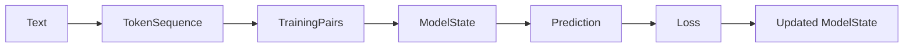

# Start Here

Category Theory for Tiny ML in Rust is a public book and Rust lab for engineers
who want to understand AI systems below the framework layer.

Status: public working draft. The current material is being published now so
readers can use it, run it, and improve it with concrete feedback. It is not
the completed textbook yet.

Frameworks made AI accessible.
Tiny typed systems can make parts of AI understandable.

## Who this is for

This project is for:

- ML engineers who can use frameworks but want to understand what they hide
- Rust engineers who want a serious path into AI
- category-theory-curious engineers who want executable examples
- serious learners tired of shallow tutorials

## What you will build

A tiny ML pipeline:

```text
Text
→ Tokens
→ Training Pairs
→ Model State
→ Prediction
→ Loss
→ Updated Model State
```

The same first mental model as a diagram:



## What this project is not

This is not a PyTorch replacement.
This is not category theory as decoration.
This is not abstraction cosplay.

The goal is executable structure.

## Best reading path

If Rust, ML, or category theory is new for you, start with
[docs/beginner-path.md](docs/beginner-path.md). It gives a slower first-session
route with stop signs for the first confusing terms.

If you already know one side of the project, use a focused route:

- [REVIEWERS.md](REVIEWERS.md) if you want to help validate the book by filing
  one direct reader report
- [docs/rust-path.md](docs/rust-path.md) for Rust engineers who want to see how
  types, traits, constructors, and tests carry ML meaning
- [docs/ml-path.md](docs/ml-path.md) for ML engineers who want to map framework
  habits to tiny explicit objects and transformations
- [docs/category-theory-path.md](docs/category-theory-path.md) for readers who
  want category-theory vocabulary anchored to runnable Rust boundaries
- [challenges/README.md](challenges/README.md) if you want the public challenge
  tracks: compiler-fix exercises and Paper-To-Rust seeds
- [docs/review-path.md](docs/review-path.md) if you want to help by filing one
  precise clarity report
- [docs/review-examples.md](docs/review-examples.md) if you want to see what a
  useful evidence-shaped report looks like before opening an issue

1. [Domain Objects](book/src/01-domain-objects.md)
2. [Morphism and Composition](book/src/02-morphisms-composition.md)
3. [The Tiny ML Pipeline](book/src/03-ml-pipeline.md)
4. [Training as an Endomorphism](book/src/04-training-endomorphism.md)
5. [Exercises](book/src/exercises.md)

## First-session checkpoints

Use this table to keep the first session concrete. Each row has one reading
target, one command, and one sentence you should be able to explain before
moving on.

| Step | Read | Run | Explain before moving on |
| --- | --- | --- | --- |
| 1 | [Domain Objects](book/src/01-domain-objects.md) | `cargo run --example 01_domain_objects` | why `TokenId` and `TokenSequence` are not just raw numbers and vectors |
| 2 | [Morphism and Composition](book/src/02-morphisms-composition.md) | `cargo run --example 02_morphism_composition` | why `Embedding -> LinearToLogits` composes but `Embedding -> Softmax` does not |
| 3 | [The Tiny ML Pipeline](book/src/03-ml-pipeline.md) | `cargo run --bin category_ml` | how logits become a distribution and how a target token turns that distribution into loss |
| 4 | [Training as an Endomorphism](book/src/04-training-endomorphism.md) | `cargo run --example 03_training_endomorphism` | why training returns updated `Parameters` instead of returning only a number called loss |
| 5 | [Exercises](book/src/exercises.md) | choose one beginner exercise | which code boundary or output line proves your answer |

## First command

Run:

```bash
cargo run --example 01_token_sequence
```

The output shows raw text becoming token ids and next-token training pairs:

```text
Text -> TokenSequence -> TrainingPairs
```

Then run the first composition example:

```bash
cargo run --example 02_morphism_composition
```

That output shows why typed transformations compose only when the middle object
matches:

```text
Embedding then LinearToLogits is legal because Vector == Vector
Embedding then Softmax is illegal because Vector != Logits
```

## First public challenge

After the first two examples, open [challenges/README.md](challenges/README.md).

Use the seed tracks in this order:

1. Typed AI Rustlings: fix `token_id_not_usize`.
2. Typed AI Rustlings: fix `logits_are_not_probabilities`.
3. Paper-To-Rust: run `cargo run --example challenge_adam`.

The challenge promise is:

```text
Learn AI by fixing compiler errors.
Stop summarizing papers. Compile one idea.
```

## First public workshop

The first public workshop for this project is open for registration:

[Register for the public workshop](https://luma.com/event/evt-Pb1kYMQvzs8JrQq)

## How to give feedback

Open the [chapter clarity feedback form](https://github.com/hghalebi/category_theory_transformer_rs/issues/new?template=chapter-clarity.yml)
for:

- unclear explanations
- missing Rust examples
- missing diagrams
- overloaded math terms
- Rust idiom improvements
- ML intuition gaps

If feedback comes from a reading club or workshop, one facilitator can
transcribe one participant's report. Use `reading-session report` or
`workshop report` in the command or page field, keep one visible evidence
signal, and do not include names, email addresses, private messages, or contact
details. Do not merge several people's comments into one report.

## Open The Right Report

Use the closest link after your first session. The link fills the route, not
the evidence; the evidence signal should come from what you personally read,
ran, or attempted.

| Perspective | Report link |
| --- | --- |
| Rust engineer | [Open Rust engineer report](https://github.com/hghalebi/category_theory_transformer_rs/issues/new?template=chapter-clarity.yml&title=%5Bgood+first+feedback%5D+Rust+engineer+brief&location=docs%2Frust-path.md&command=cargo+run+--example+01_domain_objects%0Acargo+run+--example+02_morphism_composition%0Acargo+test+domain%3A%3Atests+--lib%0Acargo+test+category%3A%3Atests+--lib) |
| ML engineer or learner | [Open ML engineer report](https://github.com/hghalebi/category_theory_transformer_rs/issues/new?template=chapter-clarity.yml&title=%5Bgood+first+feedback%5D+ML+engineer+brief&location=docs%2Fml-path.md&command=cargo+run+--example+01_token_sequence%0Acargo+run+--bin+category_ml%0Acargo+run+--example+03_training_endomorphism%0Acargo+run+--example+07_transformer_training_state) |
| Category-theory reader | [Open category-theory reader report](https://github.com/hghalebi/category_theory_transformer_rs/issues/new?template=chapter-clarity.yml&title=%5Bgood+first+feedback%5D+category-theory+reader+brief&location=book%2Fsrc%2Froadmap.md+-%3E+Category+Shape+Diagnostic+-%3E+Reader+Evidence+Handoff&command=cargo+run+--example+06_attention_scores) |
| Technical educator | [Open technical educator report](https://github.com/hghalebi/category_theory_transformer_rs/issues/new?template=chapter-clarity.yml&title=%5Bgood+first+feedback%5D+technical+educator+brief&location=README.md%2C+START_HERE.md%2C+docs%2Feducator-path.md%2C+book%2Fsrc%2Fwelcome.md%2C+book%2Fsrc%2F00-map.md%2C+or+book%2Fsrc%2Fexercises.md&command=public+book+review+path+or+local+file+review) |
| Beginner-adjacent learner | [Open beginner-adjacent learner report](https://github.com/hghalebi/category_theory_transformer_rs/issues/new?template=chapter-clarity.yml&title=%5Bgood+first+feedback%5D+beginner-adjacent+reader+brief&location=Welcome%2C+Course+Map%2C+Domain+Objects%2C+or+Morphism+and+Composition&command=cargo+run+--example+01_token_sequence+or+public+book+path) |

For category-theory precision, the narrowest useful target is the roadmap
Source-Target Audit Card after `cargo run --example 06_attention_scores`.
Start with the Q/K/V diagnostic line:

```text
query rows own score rows; key/value rows own score columns
```

Then report whether that line makes score ownership clear before the attention
weights appear.

The most useful feedback names:

```text
Chapter or file:
Friction lens:
Command or page tried:
Evidence signal:
First unclear sentence, output line, or exercise prompt:
Last clear idea:
What you expected:
What happened instead:
What would have helped:
```

If this is your first report, compare it with
[docs/review-examples.md](docs/review-examples.md). The examples show the
shape of useful evidence; they are not reports to copy.
