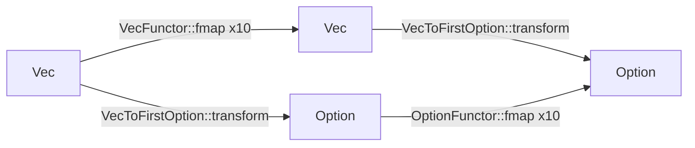
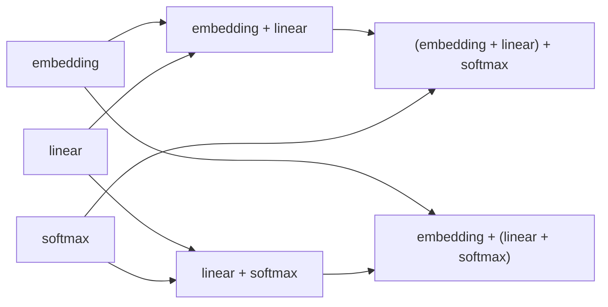

# Functors, Naturality, Monoids, and Chain Rule

The problem this chapter solves is:

> After seeing individual ML arrows, you need names for common structures that
> appear across many systems: mapping inside containers, converting containers
> consistently, combining traces, and composing local derivatives.

The previous chapters were mostly about one pipeline. This chapter zooms out
from that pipeline and asks which shapes keep appearing even when the concrete
data changes. Once you can see those repeated shapes, the category-theory
vocabulary stops feeling like a separate subject. It becomes a set of names for
ordinary engineering moves.

This chapter covers four patterns:

```text
Functor
NaturalTransformation
Monoid
Chain rule
```

They are not separate from the ML pipeline.

They explain patterns you already saw:

- mapping over many examples
- converting one wrapper shape to another
- combining pipeline traces
- composing gradients through layers

> Reader orientation:
> This chapter is more abstract than the previous ones. Read each section in
> this order: first the Rust mechanism, then the ML use, then the
> category-theory name. The names are not decoration; they are compression for
> patterns that appear repeatedly in real model code.

## Chapter Outcomes

By the end of this chapter, you should be able to:

- trace a functor, natural transformation, monoid, and chain-rule example
  through concrete Rust code,
- explain which two paths must agree in the naturality and monoid examples,
- distinguish the tiny `MulOp::backward` local derivative boundary from a full
  automatic-differentiation engine.

## What You Already Know

If you have mapped over a `Vec`, handled an `Option`, appended logs, or applied
the chain rule in calculus, you already know informal versions of this chapter.
The new work is to name those repeated shapes and connect them to the same
typed pipeline discipline used earlier.

## Trace Both Paths Before The Names

Before reading `src/structure.rs` or `src/calculus.rs`, trace the paths first.
The formal names in this chapter should arrive after the reader can see what
has to agree.

The first two-path check is about converting a vector into an optional first
item.

```text
Path 1:
Vec<A> --map f--> Vec<B> --first--> Option<B>

Path 2:
Vec<A> --first--> Option<A> --map f--> Option<B>
```

Both paths should return the same `Option<B>`. The code names that agreement
with `naturality_square_holds_for_first_option`.

The second two-path check is about grouping a trace.

```text
Path 1:
(embedding <> linear) <> softmax

Path 2:
embedding <> (linear <> softmax)
```

Both paths should produce the same `PipelineTrace`. The empty trace should also
leave any real trace unchanged.

The chain-rule check has a different shape: one path goes forward through the
computation, and one path carries derivative information backward.

```text
Forward:
x, y -> z = x * y -> L

Backward:
dL/dz -> dL/dx and dL/dy
```

For `z = x * y`, the local derivatives are:

```text
dz/dx = y
dz/dy = x
```

So the backward path scales those local derivatives by the upstream gradient:

```text
dL/dx = dL/dz * y
dL/dy = dL/dz * x
```

That is the useful mental model before any abstraction:

```text
same result by two structural paths
or
same gradient signal carried through local paths
```

Now the names can be useful. A functor preserves wrapper shape while mapping
inside it. A natural transformation makes the two wrapper-conversion paths
agree. A monoid lets trace grouping stop mattering. The chain rule composes
local derivative information.

## Source Snapshots

`src/structure.rs` covers functors, natural transformations, and monoids.

<details>
<summary>Source snapshot: src/structure.rs</summary>

```rust,ignore
{{#include ../../src/structure.rs}}
```

</details>

`src/calculus.rs` keeps the chain-rule example deliberately small.

<details>
<summary>Source snapshot: src/calculus.rs</summary>

```rust,ignore
{{#include ../../src/calculus.rs}}
```

</details>

## The Whole Structure File

`src/structure.rs` defines:

```text
Functor<A, B>
VecFunctor
OptionFunctor
NaturalTransformation<A>
VecToFirstOption
Monoid
TraceStep
PipelineTrace
```

Each block gives a Rust handle to one abstract pattern.

## Worked Example: Mapping Over A Vector

Before reading the traits, start with the plain Rust operation that motivates
them. Mapping over a vector means taking each item out, applying a function, and
collecting the new values into another vector:

```rust
let values = vec![1, 2, 3];
let doubled: Vec<i32> = values.into_iter().map(|x| x * 2).collect();

assert_eq!(doubled, vec![2, 4, 6]);
```

There is no category theory hidden in that snippet. It is just ordinary Rust.
The category-theory word `functor` appears when we notice the reusable shape:
the code changes the contents while preserving the surrounding container.

## Self-Check

Before reading the `Functor` trait, explain what stayed the same and what
changed in the `Vec` mapping example.

## Four Patterns, Four Questions

This chapter is easier if you do not try to memorize four category-theory words
at once. Treat each word as an answer to one engineering question.

| Pattern | Engineering question | Course example |
| --- | --- | --- |
| Functor | Can I transform values inside a wrapper without changing the wrapper shape? | `VecFunctor::fmap`, `OptionFunctor::fmap` |
| Natural transformation | Can I convert one wrapper shape to another consistently? | `Vec<A> -> Option<A>` |
| Monoid | Can I combine many values with an empty value that changes nothing? | `PipelineTrace` |
| Chain rule | Can I compose local derivative signals through a computation? | `MulOp::backward` |

The chapter's tests mirror that progression. They check small functor-law
examples, a naturality square, monoid laws for traces, and the local chain-rule
gradient for multiplication. The tests are not a full mathematical proof of all
possible cases. They are executable anchors for the patterns the book is
teaching.

The law and boundary map is:

| Pattern | Law or boundary | What the code checks |
| --- | --- | --- |
| Functor | identity and composition should be preserved | `VecFunctor` examples map identity and composed functions |
| Natural transformation | mapping before conversion should match conversion before mapping | `naturality_square_commutes` |
| Monoid | empty value and grouping should not change the combined trace | `pipeline_trace_obeys_monoid_laws` |
| Chain rule | upstream gradient should scale local derivatives | `multiply_backward_scales_with_upstream_gradient` |

Use this table as the chapter's visual index. If a later section feels
abstract, return to the row and ask which Rust test makes the law visible.

## What Is A Law, A Test, Or An Analogy?

This chapter uses mathematical names, executable tests, and engineering
analogies. Those are related, but they are not the same kind of evidence.

| Claim in this chapter | Evidence in this repository | How to read it |
| --- | --- | --- |
| Functor identity and composition are laws | `VecFunctor` tests with concrete values | The tests are examples of the laws, not a proof for every possible type |
| `Vec<A> -> Option<A>` is structure-preserving | `naturality_square_commutes` | The test checks one concrete naturality square for the first-item conversion |
| `PipelineTrace` behaves like a monoid | `pipeline_trace_obeys_monoid_laws` | The code checks empty-trace and grouping behavior for this trace type |
| `MulOp::backward` follows the chain rule | `multiply_backward_scales_with_upstream_gradient` | The test checks one local derivative rule for multiplication |
| Larger ML systems can use the same patterns | chapter prose and exercises | This is a transfer analogy until a larger typed implementation exists |

The rule for this book is conservative: a law word should point to a concrete
Rust test, and an analogy should be named as an analogy. That keeps the chapter
useful without pretending that a few tests prove all of category theory.

## Source-Backed Precision Rules

This chapter uses external sources to keep the structure vocabulary precise.
Each source supports a limited claim; these citations are not proof that this
crate implements a full category-theory library or a production
automatic-differentiation engine.

| Source | What the source supports | Local rule in this chapter | Rust evidence |
| --- | --- | --- | --- |
| [Categories for the Working Mathematician](https://link.springer.com/book/10.1007/978-1-4757-4721-8) | Functors, natural transformations, and monoids are formal category-theory structures with laws, not just programming metaphors. | Use formal vocabulary only where the local Rust boundary names a concrete structure and the text states what the tests do not prove. | `Functor<A, B>`, `naturality_square_commutes`, `pipeline_trace_obeys_monoid_laws` |
| [Category Theory for Programming](https://arxiv.org/abs/2209.01259) | Category-theory topics can be introduced through programming-shaped examples and functional-language structure. | Use `Functor`, naturality, and monoid as names for checked local patterns, not as a claim that the crate models all categorical laws. | `Functor<A, B>`, `VecFunctor`, `OptionFunctor`, `pipeline_trace_obeys_monoid_laws` |
| [Seven Sketches](https://arxiv.org/abs/1803.05316) | Applied category theory can be taught through concrete examples before formal generality. | The chapter introduces laws through inspectable Rust examples before broad abstraction. | `naturality_square_holds_for_first_option`, `PipelineTrace` |
| [D2L Backpropagation and Computational Graphs](https://d2l.ai/chapter_multilayer-perceptrons/backprop.html) | Forward propagation stores intermediate values, and backpropagation computes gradients through the graph using the chain rule. | The local calculus example keeps only one operation and one upstream-gradient boundary. | `MulOp::forward`, `MulOp::backward`, `LocalGradient` |
| [Automatic differentiation in machine learning: a survey](https://arxiv.org/abs/1502.05767) | Automatic differentiation evaluates derivatives of programs and is broader than one hand-written backpropagation example. | Keep `MulOp::backward` framed as one local derivative boundary, not as a general AD implementation. | `MulOp::backward`, `LocalGradient` |
| [PyTorch Autograd Mechanics](https://docs.pytorch.org/docs/stable/notes/autograd.html) | Production autograd records a graph, saves needed tensors, and traverses the graph backward with the chain rule. | `MulOp::backward` is a microscope for one local derivative rule, not a replacement for dynamic autograd. | `multiply_backward_returns_local_chain_rule_gradients`, `multiply_backward_scales_with_upstream_gradient` |
| [Backprop as Functor](https://arxiv.org/abs/1711.10455) | Backpropagation and parameter-update rules can be studied compositionally under stated assumptions. | The chapter uses this as advanced context only; the local claim is a pair of explicit derivative tests, not a monoidal-functor proof. | `MulOp::backward`, `cargo test calculus::tests` |

The transfer pattern is:

```text
source claim -> local typed boundary -> validation command or test
```

For this chapter, that means reading `cargo run --example
04_structure_and_calculus`, `cargo test structure::tests`, and `cargo test
calculus::tests` as evidence for these small law-shaped examples, not as
evidence that every functor, natural transformation, monoid, or differentiable
program has been modeled.

## `Functor<A, B>`

The problem this block solves is:

> The code needs a name for "apply a function inside a wrapper while keeping the
> wrapper shape."

First principle: a trait is a contract. It says, "any type that implements this
trait must provide these associated types and this method." Here the contract is
small on purpose. It does not try to model every possible functor in
mathematics; it gives this tutorial one precise place to talk about `fmap`.

The block:

```rust,ignore
/// A minimal functor interface for this tutorial.
pub trait Functor<A, B> {
    type WrappedA;
    type WrappedB;

    fn fmap<F>(wrapped: Self::WrappedA, f: F) -> Self::WrappedB
    where
        F: Fn(A) -> B;
}
```

## Rust Syntax

`Functor<A, B>` is a trait. A trait is Rust's way to name behavior that many
types can implement.

Here, the behavior is:

```text
map a function through some wrapper shape
```

`A` and `B` are generic type parameters:

```text
A = input item type
B = output item type
```

Generic means the trait is not tied to one concrete type like `i32` or
`String`. The same trait can describe `Vec<i32> -> Vec<String>`,
`Option<TokenId> -> Option<Embedding>`, or any other pair of item types.

It has associated types:

```rust,ignore
type WrappedA;
type WrappedB;
```

Associated types are type names chosen by each implementation of the trait.
They let the trait say:

```text
every implementer must tell us what wrapped input and wrapped output mean
```

For `VecFunctor`, those associated types become `Vec<A>` and `Vec<B>`.

For `OptionFunctor`, they become `Option<A>` and `Option<B>`.

The method:

```rust,ignore
fn fmap<F>(wrapped: Self::WrappedA, f: F) -> Self::WrappedB
where
    F: Fn(A) -> B;
```

means:

> Given a wrapped `A` and a function `A -> B`, produce a wrapped `B`.

The `where` clause is a readable place to put a bound. The bound:

```rust,ignore
F: Fn(A) -> B
```

means `F` must be callable like a function that consumes an `A` and returns a
`B`.

Here is the real crate API in the smallest useful form:

```rust,ignore
use category_theory_transformer_rs::{Functor, VecFunctor};

let lengths = VecFunctor::fmap(vec!["cat", "rust"], |word| word.len());

assert_eq!(lengths, vec![3, 4]);
```

> What to notice:
> The call names the structure once: `VecFunctor::fmap`. The closure only
> describes the item-level operation: `&str -> usize`. The vector shape is
> handled by the functor implementation.

## ML Concept

In ML, you often apply the same transformation across a structure:

```text
map preprocessing over a batch
map token conversion over a sequence
map loss computation over examples
```

The wrapper might be:

```text
Vec
Option
Result
batch tensor
```

The idea is:

```text
transform the contents, preserve the surrounding structure
```

## Category-Theory Concept

A functor maps:

```text
objects -> objects
morphisms -> morphisms
```

while preserving identity and composition.

This tutorial's trait is deliberately small. It focuses on the practical
`fmap` operation.

The tests in `src/structure.rs` check the two law-shaped habits this chapter
uses: mapping identity leaves values unchanged, and mapping two functions in
sequence matches mapping their composition.

## `VecFunctor`

The problem this block solves is:

> Demonstrate `fmap` for lists.

The block:

```rust,ignore
pub struct VecFunctor;

impl<A, B> Functor<A, B> for VecFunctor {
    type WrappedA = Vec<A>;
    type WrappedB = Vec<B>;

    fn fmap<F>(wrapped: Vec<A>, f: F) -> Vec<B>
    where
        F: Fn(A) -> B,
    {
        wrapped.into_iter().map(f).collect()
    }
}
```

## Rust Syntax

`VecFunctor` is a unit struct. It stores no state.

The `impl` block is a trait implementation:

```rust,ignore
impl<A, B> Functor<A, B> for VecFunctor
```

Read it as:

```text
for every A and B, VecFunctor knows how to behave as Functor<A, B>
```

The implementation chooses the associated types:

```text
WrappedA = Vec<A>
WrappedB = Vec<B>
```

The method consumes the vector:

```rust,ignore
wrapped.into_iter()
```

maps the function over every item:

```rust,ignore
.map(f)
```

and collects the result:

```rust,ignore
.collect()
```

The runnable companion example uses the same real crate API:

```rust,ignore
use category_theory_transformer_rs::{Functor, VecFunctor};

let token_ids = vec![1, 2, 3];
let shifted = VecFunctor::fmap(token_ids, |id| id + 100);

assert_eq!(shifted, vec![101, 102, 103]);
```

## ML Concept

If you have a batch of token IDs:

```text
[TokenId(1), TokenId(2), TokenId(3)]
```

and a function:

```text
TokenId -> Vector
```

mapping over the batch gives:

```text
[Vector, Vector, Vector]
```

That is the same shape as `VecFunctor`.

## Category-Theory Concept

`Vec` is list-like structure.

Mapping preserves the list shape:

```text
List A -> List B
```

The length and order remain structurally meaningful.

## `OptionFunctor`

The problem this block solves is:

> Demonstrate the same functor idea for optional values.

The block:

```rust,ignore
pub struct OptionFunctor;

impl<A, B> Functor<A, B> for OptionFunctor {
    type WrappedA = Option<A>;
    type WrappedB = Option<B>;

    fn fmap<F>(wrapped: Option<A>, f: F) -> Option<B>
    where
        F: Fn(A) -> B,
    {
        wrapped.map(f)
    }
}
```

## Rust Syntax

The wrapper types are:

```text
Option<A>
Option<B>
```

The implementation delegates to Rust's built-in:

```rust,ignore
wrapped.map(f)
```

If the value is `Some(a)`, it becomes `Some(f(a))`.

If the value is `None`, it stays `None`.

The important beginner point is that `Option` makes absence explicit in the
type. You cannot accidentally treat a missing value as a real value without
handling the `None` case.

```rust,ignore
use category_theory_transformer_rs::{Functor, OptionFunctor};

let present = OptionFunctor::fmap(Some(7), |value| value * 2);
let missing = OptionFunctor::fmap(None::<i32>, |value| value * 2);

assert_eq!(present, Some(14));
assert_eq!(missing, None);
```

## ML Concept

Optional values appear when data may be absent:

```text
maybe first token
maybe cached embedding
maybe resolved department
```

Mapping over `Option` lets you transform present values without inventing a
fake value for missing ones.

## Category-Theory Concept

`Option` is a context representing possible absence.

`fmap` lifts:

```text
A -> B
```

to:

```text
Option<A> -> Option<B>
```

## Conceptual Extension: `Distribution<T>::map`

The problem this block solves is:

> A probabilistic value may contain many possible outcomes. Sometimes you want
> to transform every possible outcome while keeping its probability attached.

The current crate's `Distribution` in `src/domain.rs` is a concrete validated
probability vector:

```rust,ignore
pub struct Distribution(Vec<f32>);
```

The block below is a conceptual generic version that explains the functor idea
for probabilistic outcomes:

```rust
pub struct Probability(f32);

pub struct Distribution<T> {
    outcomes: Vec<(T, Probability)>,
}

impl<T> Distribution<T> {
    pub fn map<U>(
        self,
        f: impl Fn(T) -> U,
    ) -> Distribution<U> {
        let outcomes = self
            .outcomes
            .into_iter()
            .map(|(value, probability)| {
                (f(value), probability)
            })
            .collect();

        Distribution { outcomes }
    }
}
```

The core idea is:

```text
map changes the values inside the distribution,
but keeps the probabilities attached to them.
```

## Rust Syntax

Start with the generic struct:

```rust
pub struct Probability(f32);

pub struct Distribution<T> {
    outcomes: Vec<(T, Probability)>,
}
```

This means:

```text
Distribution<T> = many possible T values, each paired with a probability
```

If `T` is `TokenId`, then the type is:

```rust,ignore
Distribution<TokenId>
```

If `T` is `String`, then the type is:

```rust,ignore
Distribution<String>
```

The method introduces a second generic type:

```rust,ignore
pub fn map<U>(...)
```

`T` is the old outcome type.

`U` is the new outcome type.

So the method has this shape:

```text
Distribution<T> -> Distribution<U>
```

The first parameter is:

```rust,ignore
self
```

That means the method consumes the old distribution.

After calling:

```rust,ignore
let text_dist = token_dist.map(decode);
```

the old `token_dist` has been moved and cannot be used again.

That is why the implementation can call:

```rust,ignore
self.outcomes.into_iter()
```

`into_iter()` consumes the vector and yields owned pairs:

```text
(T, Probability)
```

The function parameter is:

```rust,ignore
f: impl Fn(T) -> U
```

This means:

```text
give this method a function or closure that takes T and returns U
```

For example, a decoder might have this shape:

```text
TokenId -> String
```

Then:

```text
Distribution<TokenId> -> Distribution<String>
```

The inner mapping line is:

```rust,ignore
.map(|(value, probability)| {
    (f(value), probability)
})
```

For every pair:

```text
(value, probability)
```

the code applies `f` to the value and leaves the probability unchanged.

So:

```text
(TokenId(2), Probability(0.70))
```

can become:

```text
("Rust", Probability(0.70))
```

Finally:

```rust,ignore
.collect()
```

collects the transformed pairs back into a vector, and:

```rust,ignore
Distribution { outcomes }
```

wraps them in the new distribution.

## ML Concept

Imagine a model returns possible next tokens:

```text
TokenId(2) -> 0.70
TokenId(4) -> 0.20
TokenId(3) -> 0.10
```

Those token IDs are useful to the model, but a learner or UI might need text:

```text
TokenId(2) -> "Rust"
TokenId(4) -> "Python"
TokenId(3) -> "."
```

`map` changes the representation:

```text
Distribution<TokenId> -> Distribution<String>
```

The values change:

```text
TokenId(2) becomes "Rust"
TokenId(4) becomes "Python"
TokenId(3) becomes "."
```

The probabilities do not change:

```text
0.70 stays 0.70
0.20 stays 0.20
0.10 stays 0.10
```

So `map` is for changing the meaning or representation of each possible
outcome, not for changing the probability mass.

## Category Theory Concept

This is the functor pattern for probabilistic context.

Given a normal deterministic function:

```text
f : T -> U
```

`map` lifts it into the distribution context:

```text
Distribution<T> -> Distribution<U>
```

In functional-programming notation:

```text
fmap : (T -> U) -> Distribution<T> -> Distribution<U>
```

The outer structure is preserved:

```text
same number of possible outcomes
same probabilities
same probabilistic context
```

Only the inner values are transformed.

That is the same pattern as:

```text
Option<T> -> Option<U>
Vec<T> -> Vec<U>
Distribution<T> -> Distribution<U>
```

Different context, same functor idea.

## Concrete Example

Here is a complete conceptual example:

```rust
#[derive(Debug, Clone, Copy)]
pub struct TokenId(pub usize);

#[derive(Debug, Clone, Copy, PartialEq)]
pub struct Probability(pub f32);

#[derive(Debug, Clone)]
pub struct Distribution<T> {
    outcomes: Vec<(T, Probability)>,
}

impl<T> Distribution<T> {
    pub fn new(outcomes: Vec<(T, Probability)>) -> Self {
        Self { outcomes }
    }

    pub fn map<U, F>(self, mut f: F) -> Distribution<U>
    where
        F: FnMut(T) -> U,
    {
        let outcomes = self
            .outcomes
            .into_iter()
            .map(|(value, probability)| {
                (f(value), probability)
            })
            .collect();

        Distribution { outcomes }
    }
}

let vocab = ["I", "love", "Rust", "."];

let token_dist = Distribution::new(vec![
    (TokenId(2), Probability(0.70)),
    (TokenId(3), Probability(0.30)),
]);

let text_dist = token_dist.map(|token| {
    vocab[token.0].to_string()
});

assert_eq!(
    text_dist.outcomes,
    vec![
        ("Rust".to_string(), Probability(0.70)),
        (".".to_string(), Probability(0.30)),
    ],
);
```

Conceptually, the result is:

```text
"Rust" -> 0.70
"."    -> 0.30
```

## Why `Fn(T) -> U`

The signature:

```rust,ignore
f: impl Fn(T) -> U
```

accepts functions and closures.

It is more flexible than:

```rust,ignore
fn(T) -> U
```

because closures can capture values from the surrounding scope:

```rust,ignore
let vocab = ["I", "love", "Rust", "."];

let text_dist = token_dist.map(|token| {
    vocab[token.0].to_string()
});
```

The closure uses `vocab` from outside the closure body.

## Why A Library Might Use `FnMut`

The pedagogical signature:

```rust,ignore
f: impl Fn(T) -> U
```

is easy to read.

A more flexible library signature is often:

```rust,ignore
pub fn map<U, F>(self, mut f: F) -> Distribution<U>
where
    F: FnMut(T) -> U,
```

`FnMut` allows the closure to mutate captured state.

For example:

```rust,ignore
let mut counter = 0;

let numbered = token_dist.map(|token| {
    counter += 1;
    (counter, token)
});
```

The key ownership rule is unchanged:

```text
the method consumes the old distribution and moves each T into f
```

## `map` Versus `flat_map`

Use `map` when each possible value becomes one transformed value:

```text
T -> U
```

So:

```text
Distribution<T> -> Distribution<U>
```

Example:

```text
TokenId -> String
```

Use `flat_map` when each possible value produces another distribution:

```text
T -> Distribution<U>
```

Without flattening, the result would be:

```text
Distribution<Distribution<U>>
```

The simple distinction is:

```text
map:
  one possible value becomes one transformed value

flat_map:
  one possible value becomes many possible future values
```

In language modeling:

```text
map decodes possible tokens into text
flat_map chains uncertainty across another prediction step
```

## Algebra Version

If:

```text
D<T> = [(t1, p1), (t2, p2), ..., (tn, pn)]
```

and:

```text
f : T -> U
```

then:

```text
map(f, D<T>) = [(f(t1), p1), (f(t2), p2), ..., (f(tn), pn)]
```

The probabilities are untouched.

Only the values move through `f`.

## Core Mental Model

In Rust terms:

```text
consume self, move each T into f, preserve each Probability, collect into
Distribution<U>
```

In ML terms:

```text
decode or transform every possible outcome without changing model confidence
```

In category-theory terms:

```text
lift a deterministic morphism T -> U into the probabilistic context
Distribution<T> -> Distribution<U>
```

## `NaturalTransformation<A>`

The problem this block solves is:

> Sometimes you need to convert one wrapper shape into another without caring
> about the specific item type.

The beginner trap is to think a natural transformation is just any conversion.
It is more disciplined than that. The conversion must be compatible with
mapping. If you transform the wrapper first and then map the item, you should get
the same result as mapping first and then transforming the wrapper.

The block:

```rust,ignore
/// A structure-preserving conversion between wrappers.
pub trait NaturalTransformation<A> {
    type From;
    type To;

    fn transform(from: Self::From) -> Self::To;
}
```

## Rust Syntax

The associated types are:

```text
From
To
```

The method:

```rust,ignore
fn transform(from: Self::From) -> Self::To;
```

converts the wrapper.

The type parameter `A` represents the item type inside the wrapper.

This trait has the same shape as `Functor`: the abstract contract is public,
but each implementation chooses the concrete wrapper types through associated
types.

That is why the implementation can be generic over `A` without knowing whether
`A` is a token, a sentence, a loss value, or a trace step.

## ML Concept

Data pipelines often convert shapes:

```text
list of candidates -> optional selected candidate
batch -> first example
many diagnostics -> maybe first failure
```

The conversion should not depend on whether the item is a token, vector, or
loss.

## Category-Theory Concept

A natural transformation converts one functor into another in a way that is
uniform over the inner type.

The important word is uniform.

It should not inspect special details of `A`.

## `VecToFirstOption`

The problem this block solves is:

> Convert a list into an optional first item in a type-uniform way.

The block:

```rust,ignore
/// Natural transformation from `Vec<A>` to `Option<A>` by taking the first item.
pub struct VecToFirstOption;

impl<A> NaturalTransformation<A> for VecToFirstOption {
    type From = Vec<A>;
    type To = Option<A>;

    fn transform(from: Vec<A>) -> Option<A> {
        from.into_iter().next()
    }
}
```

## Rust Syntax

The implementation works for every `A`.

That is the role of:

```rust,ignore
impl<A> NaturalTransformation<A> for VecToFirstOption
```

The implementation does not ask for any bound on `A`. There is no `A: Clone`,
no `A: Debug`, and no `A: PartialEq`. It does not need those capabilities
because it never looks inside the item. It only changes the outer shape.

It consumes a vector:

```rust,ignore
from.into_iter()
```

then takes the first item:

```rust,ignore
.next()
```

If the vector is empty, the result is `None`.

If it has at least one item, the result is `Some(first_item)`.

```rust,ignore
use category_theory_transformer_rs::{NaturalTransformation, VecToFirstOption};

let first = VecToFirstOption::transform(vec!["embed", "linear", "softmax"]);
let empty = VecToFirstOption::transform(Vec::<&str>::new());

assert_eq!(first, Some("embed"));
assert_eq!(empty, None);
```

## ML Concept

This is like selecting the first candidate from a batch while preserving the
possibility that the batch was empty.

It does not care what the candidate type is.

## Category-Theory Concept

This is the example transformation:

```text
Vec<A> -> Option<A>
```

It is natural because it is uniform over `A`.

## Naturality Check

The problem this block solves is:

> Show that mapping first, then converting gives the same result as converting
> first, then mapping.

The function:

```rust,ignore
pub fn naturality_square_holds_for_first_option() -> bool {
    let xs = vec![1, 2, 3];
    let f = |x| x * 10;

    let path_top_then_right = VecToFirstOption::transform(VecFunctor::fmap(xs.clone(), f));
    let path_left_then_bottom = OptionFunctor::fmap(VecToFirstOption::transform(xs), f);

    path_top_then_right == path_left_then_bottom
}
```

## Rust Syntax

There are two paths.

Path one:

```text
Vec<i32> -> Vec<i32> -> Option<i32>
```

Path two:

```text
Vec<i32> -> Option<i32> -> Option<i32>
```

Both should produce the same value.

The crate exposes this as a small law check:

```rust,ignore
use category_theory_transformer_rs::naturality_square_holds_for_first_option;

assert!(naturality_square_holds_for_first_option());
```

## ML Concept

This is a consistency check for pipeline shape conversions.

It says:

```text
transform values, then select
```

matches:

```text
select, then transform the selected value
```

for this operation.

## Category-Theory Concept

This is the naturality square:

```text
Vec<A> ----fmap f----> Vec<B>
  |                     |
  | transform           | transform
  v                     v
Option<A> --fmap f--> Option<B>
```

The square commutes when both paths agree.

The same square as a data-flow diagram:



The same square as a rendered math view:

\[
\begin{array}{ccc}
\mathrm{Vec}\langle A\rangle
& \xrightarrow{\mathrm{VecFunctor::fmap}(f)}
& \mathrm{Vec}\langle B\rangle \\
\downarrow \mathrm{VecToFirstOption}
&& \downarrow \mathrm{VecToFirstOption} \\
\mathrm{Option}\langle A\rangle
& \xrightarrow{\mathrm{OptionFunctor::fmap}(f)}
& \mathrm{Option}\langle B\rangle
\end{array}
\]

How to read this diagram:

- the top path maps inside the vector, then selects the first item,
- the left-bottom path selects the first item, then maps inside the option,
- the square commutes when both paths produce the same `Option<B>`,
- the Rust handle is `naturality_square_holds_for_first_option`.

If you had to redraw this by hand, that is a useful learning signal. Redrawing
forces you to decide which objects sit at the corners and which arrows are
responsible for each conversion.

Read it as two executable paths:

```text
top then right:
Vec<i32> -> Vec<i32> -> Option<i32>

left then bottom:
Vec<i32> -> Option<i32> -> Option<i32>
```

The test passes only when both paths produce the same optional value.

## `Monoid`

The problem this block solves is:

> Some values can be combined repeatedly, and there should be an empty value
> that changes nothing.

The first-principles version is string concatenation. The empty string changes
nothing, and grouping does not change the final text:

```rust
let empty = String::new();
let a = String::from("embed");
let b = String::from(" -> linear");
let c = String::from(" -> softmax");

assert_eq!(format!("{empty}{a}"), "embed");
assert_eq!(format!("{}{}", format!("{a}{b}"), c), format!("{a}{}", format!("{b}{c}")));
```

`PipelineTrace` uses the same idea, but with named pipeline steps instead of
raw text.

The trait:

```rust,ignore
pub trait Monoid: Sized {
    fn empty() -> Self;
    fn combine(&self, other: &Self) -> Self;
}
```

## Rust Syntax

`Sized` means values of this type have a known size at compile time. In this
trait, it keeps the return type `Self` straightforward:

```rust,ignore
fn empty() -> Self;
```

`Self` means "the type implementing this trait."

The trait requires:

```text
empty() -> Self
combine(&self, other: &Self) -> Self
```

So a monoid can produce an identity value and combine two values into one.

The `combine` method borrows both traces:

```rust,ignore
fn combine(&self, other: &Self) -> Self;
```

`&self` and `&Self` are references. They let the method read the two existing
values without taking ownership of them. The method returns a new combined
value.

## ML Concept

Common monoid-like values in ML systems include logs, traces, metrics, batches,
and accumulated gradients.

You often need to combine many small values into one larger value.

## Category-Theory Concept

A monoid has:

```text
identity element
associative binary operation
```

The laws are:

```text
empty combine a = a
a combine empty = a
(a combine b) combine c = a combine (b combine c)
```

## `TraceStep` and `PipelineTrace`

The problem this block solves is:

> Pipeline execution steps should be combinable into a larger trace.

The key types:

```rust,ignore
#[derive(Debug, Clone, Copy, PartialEq, Eq)]
pub struct TraceStep(&'static str);

#[derive(Debug, Clone, PartialEq, Eq)]
pub struct PipelineTrace(Vec<TraceStep>);
```

## Rust Syntax

`TraceStep` wraps one static string.

`PipelineTrace` wraps a vector of steps.

`PipelineTrace::from_steps` collects any iterable of steps.

`names()` returns the raw names for display:

```rust,ignore
self.0.iter().map(TraceStep::name).collect()
```

These wrappers matter because two values may both be strings but mean different
things. A `TraceStep` is not a model name, a token, or a user-facing sentence.
The type keeps that meaning attached to the value.

## ML Concept

A trace can record:

```text
embedding
linear
softmax
cross_entropy
```

This is useful for understanding which stages ran.

## Category-Theory Concept

A pipeline trace is a sequence-like monoid.

The empty trace is the identity.

Combining traces is concatenation.

## `PipelineTrace` as Monoid

The problem this block solves is:

> Make traces obey the monoid interface.

The implementation:

```rust,ignore
impl Monoid for PipelineTrace {
    fn empty() -> Self {
        PipelineTrace(vec![])
    }

    fn combine(&self, other: &Self) -> Self {
        let mut combined = self.0.clone();
        combined.extend_from_slice(&other.0);
        PipelineTrace(combined)
    }
}
```

## Rust Syntax

`empty` returns an empty vector.

`combine` clones the first trace, appends the second trace, and wraps the result
again as `PipelineTrace`.

The clone is intentional here: `combine` borrows both inputs, so it cannot move
steps out of either trace. Cloning the small `TraceStep` values lets the method
produce a fresh trace while leaving the inputs usable.

```rust,ignore
use category_theory_transformer_rs::{Monoid, PipelineTrace, TraceStep};

let encoder = PipelineTrace::from_steps([TraceStep::new("embedding")]);
let head = PipelineTrace::from_steps([TraceStep::new("softmax")]);
let trace = encoder.combine(&head);

assert_eq!(trace.names(), vec!["embedding", "softmax"]);
```

## ML Concept

This is how many execution logs work:

```text
trace_a + trace_b = longer trace
```

## Category-Theory Concept

This is the list monoid specialized to trace steps.

## Monoid Law Check

The problem this block solves is:

> Verify the identity and associativity laws for the trace type.

The function:

```rust,ignore
pub fn monoid_laws_hold_for_pipeline_trace() -> bool {
    let a = PipelineTrace::from_steps(vec![TraceStep::new("embedding")]);
    let b = PipelineTrace::from_steps(vec![TraceStep::new("linear")]);
    let c = PipelineTrace::from_steps(vec![TraceStep::new("softmax")]);
    let identity = PipelineTrace::empty();

    let left_identity = identity.combine(&a) == a;
    let right_identity = a.combine(&identity) == a;
    let associativity = a.combine(&b).combine(&c) == a.combine(&b.combine(&c));

    left_identity && right_identity && associativity
}
```

## Rust Syntax

The function constructs three traces and checks three booleans.

It returns true only if all monoid laws hold for those examples.

```rust,ignore
use category_theory_transformer_rs::monoid_laws_hold_for_pipeline_trace;

assert!(monoid_laws_hold_for_pipeline_trace());
```

## ML Concept

Grouping trace combination should not change the final trace.

This matters when systems combine logs from nested pipelines.

## Category-Theory Concept

This directly checks the monoid laws:

```text
identity
associativity
```

The associativity check can be read as a grouping diagram:



The same law as a rendered math view:

\[
\begin{array}{ccc}
(\mathrm{embedding} \diamond \mathrm{linear}) \diamond \mathrm{softmax}
& = &
\mathrm{embedding} \diamond (\mathrm{linear} \diamond \mathrm{softmax})
\end{array}
\]

Here `\(\diamond\)` means `PipelineTrace::combine`. The equality is not about
string formatting. It says the final trace meaning should not depend on where
the parentheses were placed.

How to read this diagram:

- the objects are trace values,
- the arrow-like operation is `combine`,
- the identity object is `PipelineTrace::empty()`,
- the Rust handle is `monoid_laws_hold_for_pipeline_trace`.

The two final traces should contain the same step names in the same order. The
law is not about performance or formatting. It says grouping nested trace
combinations should not change what the trace means.

## The Calculus File

The problem `src/calculus.rs` solves is:

> Backpropagation is easier to understand if you first see one local derivative
> rule in isolation.

> What to notice:
> Backpropagation does not require every operation to know the whole model. Each
> operation only needs to know how its own output changes when its own inputs
> change. Composition does the rest.

The file defines:

```text
Scalar
LocalGradient
MulOp
```

## `Scalar`

The block:

```rust,ignore
#[derive(Debug, Clone, Copy, PartialEq)]
pub struct Scalar(f32);
```

## Rust Syntax

`Scalar` wraps one `f32`.

`Scalar::new` rejects non-finite values.

`value()` returns the raw float.

This repeats a pattern from the earlier domain-object chapter:

```text
private field
validating constructor
accessor
```

The raw `f32` is private, so callers cannot construct `Scalar(f32::NAN)`
directly. They must use `Scalar::new`, which returns a `Result`.

```rust,ignore
use category_theory_transformer_rs::Scalar;

let scalar = Scalar::new(2.5)?;

assert_eq!(scalar.value(), 2.5);

# Ok::<(), category_theory_transformer_rs::CtError>(())
```

## ML Concept

This is a single numeric value in a computation graph.

Examples:

```text
activation
loss component
weight
```

## Category-Theory Concept

It is the simple numeric object used in the local derivative example.

## `LocalGradient`

The block:

```rust,ignore
#[derive(Debug, Clone, Copy, PartialEq)]
pub struct LocalGradient(f32);
```

## Rust Syntax

This is another `f32` wrapper.

It has the same finite-value validation as `Scalar`.

The semantic difference is important:

```text
Scalar = forward value
LocalGradient = derivative signal
```

This is the same newtype move used throughout the crate. Both wrappers store
an `f32`, but the types prevent accidental mixing at function boundaries.

## ML Concept

A gradient tells how a loss changes when an intermediate value changes.

For example:

```text
dL/dz
```

## Category-Theory Concept

This is information flowing backward through a composed computation.

## `MulOp`

The problem this block solves is:

> Show a forward operation and its local backward rule.

The important methods:

```rust,ignore
pub fn forward(&self, x: Scalar, y: Scalar) -> CtResult<Scalar> {
    Scalar::new(x.value() * y.value())
}

pub fn backward(
    &self,
    x: Scalar,
    y: Scalar,
    upstream: LocalGradient,
) -> CtResult<(LocalGradient, LocalGradient)> {
    let dz_dx = y.value();
    let dz_dy = x.value();

    Ok((
        LocalGradient::new(upstream.value() * dz_dx)?,
        LocalGradient::new(upstream.value() * dz_dy)?,
    ))
}
```

## Rust Syntax

`forward` multiplies two scalars and validates the result.

`backward` takes:

```text
x
y
upstream gradient dL/dz
```

and returns:

```text
(dL/dx, dL/dy)
```

The return type is a Rust tuple.

The `?` operator appears twice in `backward`:

```rust,ignore
LocalGradient::new(upstream.value() * dz_dx)?
```

It means:

```text
if construction succeeded, keep the value
if construction failed, return the error from backward immediately
```

That keeps invalid numeric states at the boundary where they are created.

```rust,ignore
use category_theory_transformer_rs::{LocalGradient, MulOp, Scalar};

let mul = MulOp;
let x = Scalar::new(2.0)?;
let y = Scalar::new(3.0)?;
let z = mul.forward(x, y)?;
let (dl_dx, dl_dy) = mul.backward(x, y, LocalGradient::new(1.0)?)?;

assert_eq!(z.value(), 6.0);
assert_eq!(dl_dx.value(), 3.0);
assert_eq!(dl_dy.value(), 2.0);

# Ok::<(), category_theory_transformer_rs::CtError>(())
```

## ML Concept

For:

```text
z = x * y
```

the local derivatives are:

```text
dz/dx = y
dz/dy = x
```

By the chain rule:

```text
dL/dx = dL/dz * dz/dx = dL/dz * y
dL/dy = dL/dz * dz/dy = dL/dz * x
```

The companion tests use two upstream gradients. With `dL/dz = 1`, the gradients
are `3` and `2`. With `dL/dz = 4`, the same local rule scales them to `12` and
`8`.

## Category-Theory Concept

The chain rule is composition of local derivative maps.

A big neural network is many small maps composed forward, then many local
gradient rules composed backward.

The local multiplication example as a rendered math view:

\[
\begin{array}{ccccc}
x,y
& \xrightarrow{\mathrm{MulOp::forward}}
& z = x \cdot y
& \xrightarrow{\mathrm{loss}}
& L \\
&& \uparrow \mathrm{d}L/\mathrm{d}z && \\
\mathrm{d}L/\mathrm{d}x = (\mathrm{d}L/\mathrm{d}z)\,y
&&
\mathrm{d}L/\mathrm{d}y = (\mathrm{d}L/\mathrm{d}z)\,x
\end{array}
\]

How to read this diagram:

- the top row is the forward computation,
- the bottom row names the local backward results,
- the upstream gradient `dL/dz` is the signal being carried backward,
- the Rust handle is `MulOp::backward`.

## Production Autograd Boundary

Production frameworks do not ask the user to manually call one `backward`
method for every operation. PyTorch's autograd documentation describes a
reverse automatic-differentiation system: the forward pass records the
operations that produced tensors, and the backward pass traces that recorded
graph with the chain rule.

The tiny Rust example keeps only one local rule:

```text
MulOp::forward  : Scalar x Scalar -> Scalar
MulOp::backward : Scalar x Scalar x LocalGradient -> (LocalGradient, LocalGradient)
```

Read those as `MulOp::forward  : Scalar x Scalar -> Scalar` and
`MulOp::backward : Scalar x Scalar x LocalGradient -> (LocalGradient, LocalGradient)`.

That is not a replacement for autograd. It is a microscope for one boundary.
It answers three questions before the full graph machinery appears:

```text
which forward value must be remembered?
which local derivative is used?
which upstream gradient is being carried backward?
```

| Production autograd responsibility | Tiny Rust teaching boundary |
| --- | --- |
| record a dynamic graph during the forward pass | inspect one explicit `MulOp::forward` call |
| save intermediate tensors needed for backward rules | pass `x` and `y` back into `MulOp::backward` |
| traverse the graph backward using the chain rule | compute `dL/dx` and `dL/dy` from `dL/dz` |
| control when operations are tracked | make the local derivative boundary explicit in the type signature |

When you return to a framework, the useful question is not "where did the
chain rule go?" It is:

```text
which graph edges and saved values let the framework compose the same local
rules automatically?
```

## Run The Example

<details>
<summary>Source snapshot: examples/04_structure_and_calculus.rs</summary>

```rust,ignore
{{#include ../../examples/04_structure_and_calculus.rs}}
```

</details>

Run:

```bash
cargo run --example 04_structure_and_calculus
```

You should see mapping over `Vec`, mapping over `Option`, a naturality check, a
combined trace, a monoid law check, and local gradients for multiplication.
The example also prints the typed boundaries behind those values:

```text
Typed transformation:
VecFunctor::fmap : Vec<A> x (A -> B) -> Vec<B>
OptionFunctor::fmap : Option<A> x (A -> B) -> Option<B>
Naturality square:
Vec<A> -> Vec<B> -> Option<B>
Vec<A> -> Option<A> -> Option<B>
Monoid:
PipelineTrace x PipelineTrace -> PipelineTrace
Chain rule:
Scalar x Scalar -> Scalar
dL/dz -> (dL/dx, dL/dy)
```

## Example Output Transfer Checklist

This example is a compact law lab. Each printed line should make one
consistency condition visible.

Use the output this way:

| Example output | Boundary to own | Shortcut to reject |
| --- | --- | --- |
| `Vec fmap square: [1, 4, 9]` | a function is mapped over each item while vector order and length stay meaningful | treating `fmap` as an arbitrary rewrite of the wrapper |
| `Option fmap +1: Some(8)` | a present value can be transformed without changing the optional context | inventing a value when the option is `None` |
| `naturality square holds: true` | both paths from `Vec<A>` to `Option<B>` agree | calling any wrapper conversion natural without checking mapping compatibility |
| `trace: ["embedding", "linear", "softmax"]` | traces combine into another trace | mixing raw strings with typed trace steps at the boundary |
| `monoid laws hold: true` | empty trace and grouping do not change the trace meaning | claiming a combine operation is monoidal when empty adds a visible step |
| `dL/dx: 3` and `dL/dy: 2` | one local derivative rule sends upstream gradient backward | treating backpropagation as one giant derivative with no local rules |
| `VecFunctor::fmap : Vec<A> x (A -> B) -> Vec<B>` | the item function is lifted into the vector context | confusing item-level `A -> B` with wrapper-level `Vec<A> -> Vec<B>` |
| `Vec<A> -> Vec<B> -> Option<B>` and `Vec<A> -> Option<A> -> Option<B>` | the naturality square has two executable paths | proving only one side of a square |
| `PipelineTrace x PipelineTrace -> PipelineTrace` | the combine operation stays inside the same trace type | returning raw lists, strings, or unrelated diagnostics |
| `dL/dz -> (dL/dx, dL/dy)` | upstream gradient is distributed through local partial derivatives | dropping the upstream gradient when computing local gradients |

The four pattern names are useful only if they protect these boundaries. A
functor protects wrapper-preserving mapping. A natural transformation protects
agreement between two paths. A monoid protects repeated combination. The chain
rule protects local-to-global gradient composition.

## Output-To-Law Audit

When the example prints a result, do not stop at "it worked." Turn the output
line into a law-shaped claim and then narrow the claim back to the local Rust
evidence.

Use this audit card:

```text
output line:
Rust handle:
law or boundary:
source support:
safe non-claim:
validation command:
```

Worked audit:

```text
output line: naturality square holds: true
Rust handle: naturality_square_holds_for_first_option
law or boundary: mapping before first-or-none matches first-or-none before mapping
source support: formal naturality vocabulary; programming-shaped wrapper conversion
safe non-claim: this checks one concrete square, not every natural transformation
validation command: cargo test structure::tests::naturality_square_commutes --lib
```

Second worked audit:

```text
output line: dL/dx: 3 and dL/dy: 2
Rust handle: MulOp::backward
law or boundary: upstream gradient is multiplied by the local derivatives of x * y
source support: chain rule and reverse traversal through a computation graph
safe non-claim: this is one local derivative rule, not a production autograd engine
validation command: cargo test calculus::tests::multiply_backward_returns_local_chain_rule_gradients --lib
```

The pattern is the same as the rest of the book:

```text
visible output -> Rust handle -> law-shaped claim -> source-backed limit
```

That last step matters. A passing law-shaped test is good evidence for the
teaching example. It is not permission to claim the repository proves all
functor laws, all naturality squares, every monoid, or every differentiable
program.

## Core Mental Model

In Rust terms:

```text
traits name reusable operation shapes
unit structs demonstrate stateless operations
tests check laws
```

In ML terms:

```text
map over structures, combine traces, compose local gradients
```

In category-theory terms:

```text
functors preserve structure
natural transformations commute with mapping
monoids combine associatively with identity
chain rule composes derivative information
```

## Checkpoint

Why is "local rule plus composition" the core idea behind backpropagation?

A strong answer:

> Each operation only needs its local derivative; the chain rule composes those
> local derivatives into the gradient for the whole computation.

## Where This Leaves Us

This chapter named the repeated structures that sit underneath the small ML
pipeline. A functor explains mapping inside a wrapper. A natural transformation
explains changing wrappers consistently. A monoid explains safe accumulation. A
local gradient explains why a large training computation can be assembled from
small derivative rules.

The next chapter, [Seven Sketches Through Rust](seven-sketches-rust.md), uses
the same engineering habit on a wider set of ideas from applied category
theory. Instead of adding a larger ML model, it shows how the same typed-Rust
style can model orders, resources, database instances, design relations, signal
flow, circuits, and local-to-global behavior.

## Further Reading

Do not read these links as a bibliography to admire. Read them as a transfer
path from the small laws in this chapter to larger systems.

Start from the local Rust evidence:

```text
VecFunctor::fmap : Vec<A> x (A -> B) -> Vec<B>
naturality_square_holds_for_first_option() -> bool
PipelineTrace x PipelineTrace -> PipelineTrace
MulOp::backward : Scalar x Scalar x LocalGradient -> (LocalGradient, LocalGradient)
```

Then read the sources in this order:

| Source | What to transfer back into this chapter | Local evidence to inspect |
| --- | --- | --- |
| [Categories for the Working Mathematician](https://link.springer.com/book/10.1007/978-1-4757-4721-8) | Functor, natural transformation, and monoid are formal structures with laws; the local tests are examples, not universal proofs. | `Functor<A, B>`, `naturality_square_commutes`, `pipeline_trace_obeys_monoid_laws` |
| [Category Theory for Programming](https://arxiv.org/abs/2209.01259) | Functor and monoid names are useful only when they point to operation shapes and laws. | `Functor<A, B>`, `VecFunctor`, `OptionFunctor`, `monoid_laws_hold_for_pipeline_trace` |
| [Seven Sketches](https://arxiv.org/abs/1803.05316) | Applied category theory can begin with concrete examples before general formalism. | `naturality_square_holds_for_first_option`, `PipelineTrace` |
| [D2L Backpropagation and Computational Graphs](https://d2l.ai/chapter_multilayer-perceptrons/backprop.html) | Backpropagation reverses the forward dependency path and uses the chain rule over stored intermediates. | `MulOp::forward`, `MulOp::backward` |
| [The Matrix Calculus You Need For Deep Learning](https://arxiv.org/abs/1802.01528) | Matrix-calculus notation is support for understanding local derivative rules, not a prerequisite for running the tiny example. | `LocalGradient`, `Scalar` |
| [Automatic differentiation in machine learning: a survey](https://arxiv.org/abs/1502.05767) | Automatic differentiation is a general program-derivative technique; the local example is one visible derivative boundary. | `MulOp::backward`, `LocalGradient` |
| [PyTorch Autograd Mechanics](https://docs.pytorch.org/docs/stable/notes/autograd.html) | Production systems record a graph and traverse it backward; this chapter keeps one local backward rule visible. | `multiply_backward_returns_local_chain_rule_gradients`, `multiply_backward_scales_with_upstream_gradient` |
| [Backprop as Functor](https://arxiv.org/abs/1711.10455) | Backpropagation can be studied compositionally under stated assumptions. | Advanced context only; do not promote this chapter's tests into a proof of the paper's theorem. |

Use [Glossary](glossary.md) when a word becomes slippery. Use
[References](references.md) when you want the full source list.

After reading one external source, ask four questions:

1. Which exact Rust type or function did it clarify?
2. Which law, local derivative, or path agreement did it support?
3. Which claim did it **not** license this chapter to make?
4. Which command would you run to inspect the local evidence?

For this chapter, the commands are:

```bash
cargo run --example 04_structure_and_calculus
cargo test structure::tests --lib
cargo test calculus::tests --lib
```

If you can answer those questions, the external sources have transferred back
into the code.

## Practice After This Chapter

Use [Exercise 14](exercises.md#exercise-14-trace-naturality-and-monoid-laws)
to trace the naturality square and monoid laws back to the exact tests. This is
the chapter's main transfer check: a term such as "natural transformation" or
"monoid" should point to a runnable law check, not only to a definition.

## Retrieval Practice

### Recall

Recover the four reusable structures before using their names.

First, state what a functor does to values inside a wrapper.

Then name the two paths that must agree in the `Vec<A> -> Option<A>`
naturality square.

Next, name the two laws that make `PipelineTrace` a monoid-like trace type in
this chapter.

Finally, for `MulOp::backward`, name the local derivatives used for
`z = x * y`.

### Explain

Separate the law, the test, and the analogy.

Explain why `OptionFunctor::fmap(None::<i32>, |value| value * 10)` is expected
to return `None`.

Explain why `VecToFirstOption::transform` does not need a bound such as
`A: Clone` or `A: Debug`.

Explain why a pipeline trace is a good example of a monoid.

Then explain why the functor, naturality, and monoid tests are executable
anchors rather than full mathematical proofs.

### Apply

Use the runnable example and the law checks.

1. For `xs = vec![1, 2, 3]` and `f = |x| x * 10`, compute both naturality paths:

   ```text
   Vec<i32> --fmap f--> Vec<i32> --first--> Option<i32>
   Vec<i32> --first--> Option<i32> --fmap f--> Option<i32>
   ```

2. For trace steps `embedding`, `linear`, and `softmax`, write both groupings
   checked by associativity:

   ```text
   (embedding <> linear) <> softmax
   embedding <> (linear <> softmax)
   ```

   What list of names should both produce?
3. For `x = 2`, `y = 3`, and upstream gradient `dL/dz = 4`, what should
   `MulOp::backward` return for `dL/dx` and `dL/dy`?
4. Write a small example of a value in your own codebase that has an empty value
   and a combine operation. State the identity law it should satisfy.

### Debug

For each broken explanation, name the missing law or wrong boundary:

```text
mapping a Vec and changing its length without saying why
transforming Vec<A> to Option<A> by inspecting special details of A
combining traces where empty <> trace adds a visible step
claiming backpropagation is one giant derivative instead of composed local rules
```

A strong answer should point back to the concrete Rust checks:

```text
VecFunctor identity and composition tests
naturality_square_commutes
pipeline_trace_obeys_monoid_laws
multiply_backward_scales_with_upstream_gradient
```

The goal is not to recite category-theory vocabulary. The goal is to recognize
which consistency condition the code is protecting.
