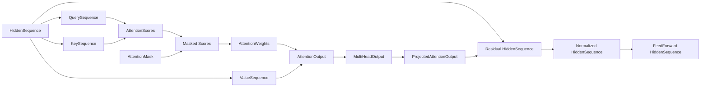

# Transformer Roadmap

The problem this chapter solves is:

> The repository name points toward Transformers, but the current code is a
> foundation course. This chapter explains exactly how the current objects and
> morphisms point toward a future attention-based model.

The current code is not a full Transformer.

It teaches the typed pieces you need first:

```text
tokens
vectors
logits
probabilities
loss
training updates
composition
```

This distinction matters. A roadmap should not pretend the current crate is a
production Transformer or a full sequence model. It should show how the current
typed skeleton can grow without losing the discipline that made the small
examples understandable.

> Reader orientation:
> Read this chapter as an engineering migration plan, not as a promise that the
> current code already contains every Transformer component.

The source path for this roadmap is:

```text
current Rust pipeline
  -> original Transformer architecture
  -> implementation-oriented attention tutorials
  -> future typed Rust milestones
```

The original Transformer paper introduced an architecture based on attention
instead of recurrence or convolution for sequence transduction. Dive into Deep
Learning gives a practical learning path through queries, keys, values,
multi-head attention, self-attention, positional encoding, and the full
Transformer architecture. Implementation tutorials such as The Annotated
Transformer and visual explainers such as The Illustrated Transformer are
useful bridges from paper notation to code and diagrams.

Framework documentation such as PyTorch's attention and Transformer layer APIs
is useful for one narrower purpose: checking the public shapes that production
tools expose. This chapter does not copy those APIs. It uses them as a sanity
check while keeping the teaching path smaller and typed.

The Hugging Face course also gives a useful distinction for this roadmap:
architecture, checkpoint, and model are not the same idea. This repository is
working on architecture pieces: named states, typed boundaries, and update
rules. It is not loading a pretrained checkpoint, and it is not wrapping a
large framework model output. When this chapter uses words such as
`HiddenSequence`, `AttentionWeights`, or `SequenceLogits`, read them as tiny
Rust-owned teaching objects that make the same roles inspectable.

There is also advanced category-theory work that studies attention more
directly. One recent source introduces a category-theoretic diagrammatic
formalism for decomposing attention mechanisms into anatomical components and
comparing attention variants. Another treats the linear query, key, and value
maps through a parametric categorical lens and studies how layered
self-attention structure can be composed. These sources are useful precision
support, but they are not a license to call every part of a Transformer the
same categorical object. The parametric-endofunctor paper itself separates its
linear focus from nonlinear pieces such as softmax and layer normalization.
This roadmap follows the same caution: name the linear maps, product-input
boundaries, shape-preserving endomorphisms, and state updates separately.

This chapter keeps those sources in view, but it does not import their full
complexity all at once. The rule is: add one typed concept only when the tiny
Rust version can explain its boundary.

## What You Already Know

If you understand the current prediction path, you already know the skeleton a
Transformer will extend. Tokens become vectors, vectors move through typed
transformations, and probabilities feed a loss. The future work is to replace
the one-token middle with sequence-aware structure.

## Transformer Role Ownership Map

Before reading the implementation status table, separate the roles. A
Transformer explanation becomes hard when query, key, value, score, weight,
mask, and hidden-state roles all look like raw vectors or matrices. This
roadmap assigns each role to a named Rust type or boundary.

| Transformer role | Rust owner | Boundary shape | Confusion prevented |
| --- | --- | --- | --- |
| hidden state sequence | `HiddenSequence` | model-width rows over sequence positions | treating one token vector as a full sequence |
| query role | `QuerySequence` and `HiddenToQuery` | `HiddenSequence -> QuerySequence` | passing values where queries are expected |
| key role | `KeySequence` and `HiddenToKey` | `HiddenSequence -> KeySequence` | comparing against value vectors instead of keys |
| value role | `ValueSequence` and `HiddenToValue` | `HiddenSequence -> ValueSequence` | mixing scores directly instead of value vectors |
| raw attention scores | `AttentionScores` | `QuerySequence x KeySequence -> AttentionScores` | treating unnormalized scores as probabilities |
| mask | `AttentionMask` | `AttentionScores x AttentionMask -> AttentionScores` | allowing illegal positions into softmax |
| normalized attention weights | `AttentionWeights` | `AttentionScores -> AttentionWeights` | forgetting that each query row is a distribution over source positions |
| value mixing | `AttentionOutput` | `AttentionWeights x ValueSequence -> AttentionOutput` | multiplying weights without saying what information is read |
| multiple heads | `AttentionHeadOutputs` and `MultiHeadOutput` | head outputs -> concatenated model-width rows | losing head count and head dimension |
| output projection | `ProjectedAttentionOutput` | `MultiHeadOutput -> ProjectedAttentionOutput` | leaving concatenated heads at the wrong width |
| residual boundary | `ResidualConnection` | `HiddenSequence x ProjectedAttentionOutput -> HiddenSequence` | adding tensors that cannot return to the block input shape |
| layer normalization | `LayerNormalization` | `HiddenSequence -> HiddenSequence` | changing values while accidentally changing the public object |
| feed-forward sublayer | `PositionWiseFeedForward` | `HiddenSequence -> HiddenSequence` | forgetting that the sublayer is position-wise and shape-preserving |
| block mask boundary | `MaskedMultiHeadTransformerBlock` | `HiddenSequence x AttentionMask -> HiddenSequence` | hiding the mask inside loose optional state |
| sequence readout | `TransformerReadout` and `SequenceLogits` | `HiddenSequence -> SequenceLogits` | confusing hidden states with vocabulary scores |
| training state | `TransformerTrainingState` | state plus learning rate plus step count | passing loose parameters without optimizer context |

This table is the chapter's first debugging tool. If a later attention formula
feels vague, point to the row that owns the role. The typed roadmap should make
the question concrete:

```text
Which object owns this role?
Which boundary produces it?
Which invalid connection should fail?
```

## Category Naming Contract

Before this chapter calls an attention boundary an endomorphism, count its
inputs. The original Transformer architecture, the query-key-value teaching
path, and framework attention APIs all expose the same warning: attention is
not one vague arrow from a sequence to itself. Some stages need a query side
and a source side. Some stages need a mask. Some stages need the previous
hidden stream and a sublayer output.

Use this contract while reading the roadmap:

| If the boundary has shape | Name it as | Example | Do not call it |
| --- | --- | --- | --- |
| `A -> B` | ordinary morphism | `AttentionScores -> AttentionWeights` | an endomorphism |
| `A -> A` | endomorphism | `LayerNormalization : HiddenSequence -> HiddenSequence` | a product boundary |
| `A x B -> C` | product-input morphism | `AttentionWeights x ValueSequence -> AttentionOutput` | a unary transform |
| `A x B -> A` | product-input morphism returning `A` | `HiddenSequence x ProjectedAttentionOutput -> HiddenSequence` | an endomorphism unless the whole input object and output object are identical |
| missing projection or wrong role | illegal attempted composition | `HiddenSequence x MultiHeadOutput -> HiddenSequence` | a clever shortcut |

This rule keeps the category-theory vocabulary proportional to the code. The
linear query, key, value, positional, and layered pieces can be compared with
advanced categorical work on self-attention. Masking, softmax, residual
addition, normalization, feed-forward refinement, and training updates still
need their own typed boundaries in this teaching project.

## Worked Example Priority

The roadmap now has many typed attention boundaries. A reader does not need all
of them expanded at the same depth on a first pass. Use this priority table to
decide which sections deserve worked examples before more implementation is
added.

| Priority | Boundary | Why this comes first | Evidence to ask from a reader |
| --- | --- | --- | --- |
| 1 | `AttentionScores x AttentionMask -> AttentionScores -> AttentionWeights` | readers often confuse raw scores, masked scores, and probabilities | Can the reader explain which positions were removed before softmax? |
| 2 | `HiddenSequence -> QuerySequence`, `KeySequence`, `ValueSequence` | query, key, and value are numerically similar but semantically different roles | Can the reader say which role asks, which role is compared, and which role is mixed? |
| 3 | `AttentionWeights x ValueSequence -> AttentionOutput` | attention becomes useful only when weights read values | Can the reader trace one output row as a weighted sum of value rows? |
| 4 | `AttentionHeadOutputs -> MultiHeadOutput -> ProjectedAttentionOutput` | multi-head attention adds shape arithmetic that can hide mistakes | Can the reader compute `head_count * head_dimension` and name the projection input width? |
| 5 | `HiddenSequence x ProjectedAttentionOutput -> HiddenSequence` | residual addition explains why many sublayers return to the same object | Can the reader explain why mismatched sequence length or model dimension must fail? |
| 6 | `HiddenSequence -> HiddenSequence` for normalization and feed-forward | these are shape-preserving sublayers, not new sequence objects | Can the reader name what changes and what stays invariant? |
| 7 | `TransformerTrainingState -> TransformerTrainingState` | training is important, but it should come after forward shape ownership is clear | Can the reader separate readout-only, local feed-forward, and composed block updates? |

This table is not a ranking of importance. It is a ranking of teaching risk.
The first three rows protect the core attention story:

```text
roles -> scores -> masked weights -> mixed values
```

If a reader cannot trace that path, the later block and training sections will
feel like a list of names. If the reader can trace it, residuals,
normalization, feed-forward layers, and training state have a stable place to
attach.

## Worked Example: Mask Before Softmax

The original Transformer formula and implementation-oriented attention
references put softmax after query-key scoring. Practical implementations add
the attention mask to the score table before softmax. The reason is simple:
only legal positions should compete for probability mass.

The runnable attention example starts with two query positions and three key
positions:

```rust,ignore
let queries = QuerySequence::new(vec![vec![1.0, 0.0], vec![0.0, 1.0]])?;
let keys = KeySequence::new(vec![vec![1.0, 0.0], vec![0.0, 1.0], vec![1.0, 1.0]])?;
let values = ValueSequence::new(vec![vec![1.0, 10.0], vec![2.0, 20.0], vec![3.0, 30.0]])?;
let mask = AttentionMask::new(vec![vec![true, false, true], vec![true, true, true]])?;
```

For the first query row, scaled dot product produces:

```text
raw scores:
[0.7071, 0.0000, 0.7071]

mask:
[true, false, true]

masked scores:
[0.7071, very negative, 0.7071]

row-wise softmax:
[0.5, 0.0, 0.5]
```

The middle key position has a real raw score, but the mask says this query
position is not allowed to read it. The mask must therefore act before
softmax. After softmax, the illegal position would already have received
probability mass.

The value-mixing step then reads only the allowed value rows:

```text
0.5 * [1.0, 10.0]
+ 0.0 * [2.0, 20.0]
+ 0.5 * [3.0, 30.0]
= [2.0, 20.0]
```

That is why the typed path is:

```text
AttentionScores x AttentionMask -> AttentionScores
AttentionScores -> AttentionWeights
AttentionWeights x ValueSequence -> AttentionOutput
```

The mask boundary is not a cosmetic option. It protects the meaning of the
probability row. `AttentionWeights` should answer:

```text
among the positions this query may read, how much should each one contribute?
```

In this repository, masked-out scores become a very negative finite value
instead of a non-finite value so that the pedagogical constructors can keep the
"all scores are finite" invariant. The teaching meaning is the same as the
standard attention implementation pattern: make disallowed positions
effectively impossible before row-wise softmax.

## Production Masking Caveat

The tiny `AttentionMask` in `src/attention.rs` is stricter than a production
framework boundary. For example, this constructor call is rejected:

```rust,ignore
AttentionMask::new(vec![vec![false, false]])
```

The reason is pedagogical. In this book, every attention-weight row should
mean:

```text
among at least one legal source position, how much should each one contribute?
```

If a row allows no source positions, there is no probability support for that
row. The constructor therefore returns:

```text
Err(CtError::EmptyInput("attention mask row allows no keys"))
```

That boundary is intentionally less general than production Transformer
libraries. PyTorch's Transformer building-blocks tutorial discusses nested
tensors, variable sequence lengths, padding masks, and the production problem
of fully masked rows. It notes that softmax over an empty set is undefined and
that newer `scaled_dot_product_attention` behavior returns zero output for
fully masked rows.

The contrast is useful:

| Concern | Production framework boundary | Tiny teaching boundary |
| --- | --- | --- |
| variable sequence lengths | ragged batches, padding, nested tensors, and mask ergonomics | each example uses one explicit rectangular mask |
| fully masked query row | framework must decide a stable output convention | constructor rejects the row before softmax |
| performance | fused kernels, compilation, and memory-aware representations | small values the reader can inspect by hand |

This is not a disagreement with framework behavior. It is a scope decision. It
preserves the invariant that `AttentionWeights` is a row-wise
distribution over at least one source position. A future production-oriented
chapter can relax that boundary only if it also names the new output convention
for rows with no legal source positions.

## What Exists Now

The current model has this prediction path:

```text
TokenId -> Vector -> Logits -> Distribution
```

The implementation status is:

| Concept | Current status | Reason |
| --- | --- | --- |
| Token ids | implemented | `TokenId` and `TokenSequence` already exist |
| Vectors | implemented | `Vector` is the current hidden representation |
| Logits and probabilities | implemented | `LinearToLogits` and `Softmax` are executable |
| Loss | implemented | `CrossEntropy` evaluates prediction against target |
| Parameter update | implemented | `TrainStep` updates `Parameters` |
| Query-key score boundary | implemented as a tiny roadmap sketch | `QuerySequence x KeySequence -> AttentionScores` is executable |
| Attention mask boundary | implemented as a tiny roadmap sketch | `AttentionScores x AttentionMask -> AttentionScores` is executable |
| Attention score-to-weight boundary | implemented as a tiny roadmap sketch | `AttentionScores -> AttentionWeights` is executable |
| Value-mixing boundary | implemented as a tiny roadmap sketch | `AttentionWeights x ValueSequence -> AttentionOutput` is executable |
| Multi-head concatenation boundary | implemented as a tiny roadmap sketch | `AttentionHeadOutputs -> MultiHeadOutput` is executable |
| Attention output projection boundary | implemented as a tiny roadmap sketch | `MultiHeadOutput -> ProjectedAttentionOutput` is executable |
| Sequence hidden states | implemented as a tiny roadmap sketch | `HiddenSequence` is executable for residual addition |
| Residual addition boundary | implemented as a tiny roadmap sketch | `HiddenSequence x ProjectedAttentionOutput -> HiddenSequence` is executable |
| Layer normalization boundary | implemented as a tiny roadmap sketch | `HiddenSequence -> HiddenSequence` is executable through `LayerNormalization` |
| Position-wise feed-forward boundary | implemented as a tiny roadmap sketch | `HiddenSequence -> HiddenSequence` is executable through `PositionWiseFeedForward` |
| Hidden-to-query/key/value projections | implemented as a tiny roadmap sketch | `HiddenSequence -> QuerySequence`, `HiddenSequence -> KeySequence`, and `HiddenSequence -> ValueSequence` are executable |
| Single-head block boundary | implemented as a tiny roadmap sketch | `SingleHeadTransformerBlock : HiddenSequence -> HiddenSequence` composes the current boundaries |
| Multi-head block boundary | implemented as a tiny roadmap sketch | `MultiHeadTransformerBlock : HiddenSequence -> HiddenSequence` composes several `SelfAttentionHead` values |
| Positional encoding | implemented as a tiny roadmap sketch | `PositionalEncoding : HiddenSequence -> HiddenSequence` adds position rows while preserving shape |
| Masked block variants | implemented as a tiny roadmap sketch | `MaskedMultiHeadTransformerBlock : HiddenSequence x AttentionMask -> HiddenSequence` accepts a block-level mask |
| Sequence logits and readout | implemented as a tiny roadmap sketch | `TransformerReadout : HiddenSequence -> SequenceLogits` produces vocabulary scores at each sequence position |
| Structured Transformer parameter object | implemented as a tiny roadmap sketch | `TinyTransformerParameters : HiddenSequence x AttentionMask -> SequenceLogits` owns position, masked block, and readout pieces |
| Structured Transformer training state | implemented as a tiny roadmap sketch | `TransformerTrainingState` owns parameters, learning rate, and step count |
| Readout-only training step | implemented as a tiny roadmap sketch | `TransformerReadoutTrainStep : TransformerTrainingState -> TransformerTrainingState` updates only the sequence readout |
| Local feed-forward training step | implemented as a tiny roadmap sketch | `TransformerFeedForwardTrainStep : TransformerTrainingState -> TransformerTrainingState` updates only the position-wise feed-forward sublayer against hidden targets |
| Composed block training step | implemented as a tiny roadmap sketch | `TransformerBlockTrainStep : TransformerTrainingState -> TransformerTrainingState` updates readout, feed-forward, attention-output-projection, query/key/value, and layer-normalization parameters from sequence targets through residual, normalization, and attention paths |

This table is a guardrail. When extending the project, do not present planned
items as implemented content. Add the type, example, test, chapter prose, and
reference link together.

## Rust Syntax

The path is implemented with:

```text
Embedding
LinearToLogits
Softmax
Compose
```

The main domain objects are:

```text
TokenId
Vector
Logits
Distribution
Parameters
```

The training update is:

```text
TrainStep : Parameters -> Parameters
```

## ML Concept

This is a tiny next-token model.

It predicts from one token at a time.

The main training example is still that small. The roadmap module now sketches
attention blocks and structured Transformer state, but it does not yet train a
production Transformer.

Still, it already teaches the core path:

```text
discrete token
  -> dense representation
  -> vocabulary scores
  -> next-token probabilities
```

## Category Theory Concept

The current system teaches composition:

```text
TokenId -> Vector -> Logits -> Distribution
```

and endomorphism:

```text
Parameters -> Parameters
```

Those two shapes remain central in Transformers.

## Step 1: Sequences As First-Class Objects

The future problem:

> Attention does not operate on one token alone. It operates on a sequence of
> hidden states.

The current code already has `TokenSequence`, but that is a sequence of token
ids. Attention needs a sequence of hidden vectors, usually with position and
mask information attached. That is a different object with different
invariants.

## Worked Example: Validating Sequence Length

The first-principles Rust move is the same one used throughout the book: do not
let a meaningful value travel as a raw primitive once it crosses a conceptual
boundary. The roadmap module now starts with a small validating type:

```rust,ignore
#[derive(Debug, Clone, Copy, PartialEq, Eq)]
pub struct SequenceLength(usize);

impl SequenceLength {
    pub fn new(value: usize) -> CtResult<Self> {
        if value == 0 {
            return Err(CtError::EmptyInput("sequence length"));
        }

        Ok(Self(value))
    }

    pub fn value(&self) -> usize {
        self.0
    }
}
```

## Self-Check

Before reading the roadmap steps, explain why a future `SequenceLength` should
not be passed around as a bare `usize`.

## Rust Syntax

A future extension should introduce types such as:

```rust,ignore
pub struct Position(usize);
pub struct SequenceLength(usize);
pub struct HiddenSequence(Vec<Vector>);
pub struct AttentionMask(/* validated mask representation */);
```

The important rule is the same as this course:

```text
do not pass raw vectors across architectural boundaries
```

## ML Concept

Attention needs a representation like:

```text
[hidden_0, hidden_1, hidden_2, ...]
```

plus position and mask information.

## Category Theory Concept

The object changes from:

```text
Vector
```

to:

```text
Sequence(Vector)
```

The next morphisms operate on structured sequences.

Design contract:

```text
TokenSequence -> HiddenSequence
```

should not be represented as:

```text
Vec<usize> -> Vec<Vec<f32>>
```

The second shape hides every domain distinction the course has worked to make
visible.

## Step 2: Query, Key, And Value Projections

The current problem:

> Attention compares tokens by projecting hidden states into query, key, and
> value spaces.

The important design move is not only three matrices. It is three roles. A
query vector, key vector, and value vector may share the same numeric
representation, but they should not share the same Rust type once they cross a
module boundary.

## Rust Syntax

The current projection morphisms have shapes:

```text
HiddenSequence -> QuerySequence
HiddenSequence -> KeySequence
HiddenSequence -> ValueSequence
```

Each output type should be distinct.

The current roadmap code models both the role objects and the hidden-state
projection morphisms:

```text
HiddenToQuery
HiddenToKey
HiddenToValue
QuerySequence
KeySequence
ValueSequence
```

Queries, keys, and values are all vectors underneath, but they have different
roles.

## Worked Example: Same Hidden Row, Three Roles

The query-key-value split is not about three mysterious kinds of vector. It is
about three uses of a hidden state.

Start with two hidden rows:

```text
hidden_0 = [1.0, 2.0]
hidden_1 = [3.0, 4.0]
```

A tiny set of projections can send the same hidden rows into three role-specific
objects:

```rust,ignore
let hidden = HiddenSequence::new(vec![vec![1.0, 2.0], vec![3.0, 4.0]])?;

let to_query = HiddenToQuery::new(
    vec![vec![1.0, 0.0], vec![0.0, 1.0]],
    vec![0.0, 0.0],
)?;
let to_key = HiddenToKey::new(
    vec![vec![0.0, 1.0], vec![1.0, 0.0]],
    vec![0.0, 0.0],
)?;
let to_value = HiddenToValue::new(
    vec![vec![10.0, 0.0], vec![0.0, 10.0]],
    vec![0.0, 0.0],
)?;
```

For `hidden_0`, those projections produce:

```text
query_0 = [1.0, 2.0]
key_0   = [2.0, 1.0]
value_0 = [10.0, 20.0]
```

The numbers are deliberately simple. The important lesson is the role
separation:

| Role | Question it answers | Used for |
| --- | --- | --- |
| query | what is this position looking for? | compared with keys |
| key | what can this source position be matched by? | compared with queries |
| value | what information can this source position contribute? | mixed after weights exist |

If all three values were passed around as `Vec<Vec<f32>>`, the compiler could
not help a reader notice a role mistake. `ValueSequence` could accidentally be
fed into query-key scoring. `KeySequence` could accidentally be mixed as if it
were content. The typed split makes that confusion harder to express.

This also explains why the attention path has two phases:

```text
QuerySequence x KeySequence -> AttentionScores
AttentionWeights x ValueSequence -> AttentionOutput
```

Queries and keys decide where to look. Values provide what gets read.

## Self-Attention And Cross-Attention Boundary

The current roadmap example is self-attention: query, key, and value roles all
come from the same `HiddenSequence` before they are projected into separate
role objects.

That is only one attention case.

Official framework documentation exposes a more general boundary. PyTorch's
multi-head attention API accepts `query`, `key`, and `value` as separate
inputs. Its shape language distinguishes target sequence length `L` for
queries from source sequence length `S` for keys and values. Dive into Deep
Learning makes the same teaching distinction when it writes attention over
`n` queries and `m` key-value pairs.

This matters for the book because it prevents a subtle category mistake. The
attention scoring boundary is not automatically:

```text
HiddenSequence -> HiddenSequence
```

The more honest shape is:

```text
Target positions x Source positions -> attention weights
```

or, in the current Rust vocabulary:

```text
QuerySequence x KeySequence -> AttentionScores
AttentionWeights x ValueSequence -> AttentionOutput
```

Self-attention is the special case where the target positions and source
positions come from the same hidden sequence:

```text
HiddenSequence -> QuerySequence
HiddenSequence -> KeySequence
HiddenSequence -> ValueSequence
```

These are parallel projections, not a pipeline where queries turn into keys
and keys turn into values. The shared source is what makes the case
"self-attention"; the role split is still real after projection.

Cross-attention is the case where the query side and the key-value side come
from different sequence objects:

```text
TargetHiddenSequence -> QuerySequence
SourceHiddenSequence -> KeySequence
SourceHiddenSequence -> ValueSequence
```

The tiny repository does not implement a full cross-attention module yet. But
the naming rule should already be clear:

```text
same source for Q, K, V  -> self-attention case
separate query and key-value sources -> cross-attention case
```

Use this Q/K/V source diagnostic before reading a framework call:

| Question | Self-attention answer | Cross-attention answer |
| --- | --- | --- |
| Which sequence owns the query side? | the same hidden sequence | the target hidden sequence |
| Which sequence owns the key side? | the same hidden sequence | the source hidden sequence |
| Which sequence owns the value side? | the same hidden sequence | the source hidden sequence |
| Which length counts score rows? | target/query length | target/query length |
| Which length counts score columns? | source/key-value length, equal to target length in the simple self-attention case | source/key-value length, possibly different from target length |

This table prevents a common framework-reading mistake. Passing the same
hidden sequence into Q, K, and V means the source object is shared. It does not
mean the projected query, key, and value roles have become the same role.

The category-theory reading follows the input count. Self-attention can be
wrapped inside a shape-preserving block after projection, masking, value
mixing, output projection, residual addition, and normalization return to the
hidden stream. The core scoring and mixing steps are still product-input
morphisms. Cross-attention makes that product input impossible to ignore,
because the target side and source side may have different sequence lengths.

When a framework call reports an attention mask of shape `L x S`, read it as a
typed reminder:

```text
for each target position, which source positions may be read?
```

That is why this roadmap names `QuerySequence`, `KeySequence`, `ValueSequence`,
`AttentionScores`, `AttentionMask`, `AttentionWeights`, and `AttentionOutput`
separately. The names keep target-side questions, source-side comparison, and
source-side information from collapsing into one raw tensor.

## ML Concept

Queries ask:

```text
what am I looking for?
```

Keys answer:

```text
what do I contain?
```

Values provide:

```text
what information should be mixed?
```

## Category Theory Concept

These are parallel morphisms out of the same object:

```text
HiddenSequence -> QuerySequence
HiddenSequence -> KeySequence
HiddenSequence -> ValueSequence
```

The current attention example combines query and key roles to produce scores,
then uses value roles to produce output vectors.

Design contract:

```text
HiddenSequence -> QuerySequence
HiddenSequence -> KeySequence
HiddenSequence -> ValueSequence
```

should be three explicit morphisms. A single untyped vector list would make it
too easy to pass values into the wrong part of the attention computation.

## Step 3: Scaled Dot-Product Attention

The future problem:

> Convert query-key similarity into a probability distribution over positions,
> then use it to mix values.

## Rust Syntax

A typed shape could be:

```text
QuerySequence x KeySequence -> AttentionScores
AttentionScores x AttentionMask -> AttentionScores
AttentionScores -> AttentionWeights
AttentionWeights x ValueSequence -> AttentionOutput
AttentionHeadOutputs -> MultiHeadOutput
MultiHeadOutput -> ProjectedAttentionOutput
HiddenSequence x ProjectedAttentionOutput -> HiddenSequence
HiddenSequence -> HiddenSequence
```

Read the current roadmap code through this shape trace:



What to notice:

```text
Rust reading:
each box is a named type or a named typed boundary in src/attention.rs

ML reading:
scores choose positions, weights mix values, projection and residual return to
the hidden-state width

Category-theory reading:
the middle of attention is a composition with product inputs, and the enclosing
block keeps returning to HiddenSequence
```

`AttentionWeights` should be validated like `Distribution`, but over sequence
positions instead of vocabulary tokens.

The current roadmap code implements the query-key score boundary, the mask
boundary, the score-to-weight boundary, the value-mixing boundary, the
multi-head concatenation boundary, the output projection boundary, and the
residual addition and normalization boundaries:

<details>
<summary>Source snapshot: src/attention.rs</summary>

```rust,ignore
{{#include ../../src/attention.rs}}
```

</details>

The full runnable companion is:

<details>
<summary>Source snapshot: examples/06_attention_scores.rs</summary>

```rust,ignore
{{#include ../../examples/06_attention_scores.rs}}
```

</details>

The smaller state-only companion is:

<details>
<summary>Source snapshot: examples/07_transformer_training_state.rs</summary>

```rust,ignore
{{#include ../../examples/07_transformer_training_state.rs}}
```

</details>

Run it with:

```bash
cargo run --example 06_attention_scores
```

If you only want to inspect the training-state update shape, run the smaller
companion example:

```bash
cargo run --example 07_transformer_training_state
```

You should see two query positions and three key positions. Query and key
vectors first produce score rows. The mask removes one illegal score position.
Then each row is normalized independently, and the weights mix value vectors:

```text
QuerySequence x KeySequence -> AttentionScores
AttentionScores x AttentionMask -> AttentionScores
AttentionScores -> AttentionWeights
AttentionWeights x ValueSequence -> AttentionOutput
AttentionHeadOutputs -> MultiHeadOutput
MultiHeadOutput -> ProjectedAttentionOutput
HiddenSequence x ProjectedAttentionOutput -> HiddenSequence
HiddenSequence -> HiddenSequence
```

That is the bridge from the current softmax chapter. The current `Distribution`
answers:

```text
which next token is likely?
```

Attention weights answer:

```text
which source positions should this position read from?
```

Both are probability-like objects. They differ in what their support means.

## ML Concept

Attention computes:

```text
scores = QK^T / sqrt(d)
weights = softmax(scores)
output = weights V
```

This is softmax again, but applied to token-to-token interaction scores.

## Category Theory Concept

The attention block is a composition of typed maps with a product input:

```text
(Q, K, V) -> scores -> weights -> mixed values
```

Design contract:

Attention should have a positive test showing that valid shapes compose and a
negative test showing that mismatched head dimensions, mask shapes, or value
lengths are rejected at construction or composition time.

## Step 4: Multi-Head Concatenation

The current problem:

> One attention head sees one interaction pattern. Multiple heads let the model
> carry several patterns in parallel. Their outputs must be recombined without
> losing shape information.

## Rust Syntax

The recombination boundary is:

```text
AttentionHeadOutputs -> MultiHeadOutput
```

`HeadCount` rejects zero. `AttentionHeadOutputs` rejects an empty collection,
sequence-length mismatches, and head-dimension mismatches. `MultiHeadOutput`
records:

```text
sequence length
head count
head dimension
model dimension
```

This boundary is not the whole block by itself. It is the place where separate
head outputs become one wider object before the output projection.

## Worked Example: Concatenate Heads, Then Project

Multi-head attention adds one shape calculation that readers should be able to
do without a framework:

```text
model_dimension = head_count * head_dimension
```

In the runnable attention example, the first head has two output features per
query position:

```text
head_0 query_0 = [2.0, 20.0]
head_0 query_1 = [2.2033, 22.0334]
```

The example then adds a second head with the same sequence length and head
dimension:

```text
head_1 query_0 = [10.0, 1.0]
head_1 query_1 = [20.0, 2.0]
```

Concatenation does not average the heads. It places their feature rows side by
side:

```text
query_0 multi-head row = [2.0, 20.0, 10.0, 1.0]
query_1 multi-head row = [2.2033, 22.0334, 20.0, 2.0]
```

The recorded shape is:

```text
2 heads x 2 features = model dimension 4
```

The next boundary is the learned output projection:

```text
MultiHeadOutput -> ProjectedAttentionOutput
```

For the first query row, the tiny projection in the example uses:

```text
input row:
[2.0, 20.0, 10.0, 1.0]

projection rows:
[1.0, 0.0]
[0.0, 0.1]
[0.5, 0.0]
[0.0, 1.0]
```

The projected row is:

```text
first output feature  = 2.0 * 1.0 + 20.0 * 0.0 + 10.0 * 0.5 + 1.0 * 0.0 = 7.0
second output feature = 2.0 * 0.0 + 20.0 * 0.1 + 10.0 * 0.0 + 1.0 * 1.0 = 3.0

projected query_0 = [7.0, 3.0]
```

This is the reason the repository keeps two separate boundaries:

```text
AttentionHeadOutputs -> MultiHeadOutput
MultiHeadOutput -> ProjectedAttentionOutput
```

The first boundary proves that head outputs can be concatenated. The second
boundary proves that the concatenated width matches the projection input width.
If either relationship fails, the model should fail at the boundary, before a
later residual connection receives the wrong shape.

## ML Concept

Each head performs attention separately.

The outputs are concatenated, then an output projection maps the combined row
back into the hidden-state width. This repository now implements that projection
as a separate typed boundary.

## Category Theory Concept

This is parallel composition followed by recombination:

```text
head_1 x head_2 x ... x head_n -> MultiHeadOutput
```

Design contract:

`HeadCount`, `HeadDimension`, and `ModelDimension` are not bare `usize` values.
The arithmetic relationship between them is part of the architecture: if there
are two heads of width two, the concatenated model dimension is four.

## Step 5: Output Projection

The current problem:

> Concatenated heads are wider than a single head. A later Transformer block
> expects a coherent hidden width again.

## Rust Syntax

The current code models the projection as:

```text
MultiHeadOutput -> ProjectedAttentionOutput
```

`AttentionOutputProjection` validates:

```text
non-empty weight rows
non-empty bias
finite weight and bias values
weight rows matching output dimension
input dimension matching MultiHeadOutput model dimension
```

That shape follows the multi-head attention reference path: heads are
concatenated, then another learned linear projection produces the output
sequence.

## ML Concept

The projection is a learned linear map after concatenation. It lets the model
mix features across heads and return to the width expected by the surrounding
block.

## Category Theory Concept

This is another typed morphism:

```text
MultiHeadOutput -> ProjectedAttentionOutput
```

Design contract:

The projection should fail before multiplication if the concatenated head width
does not match the projection's input dimension. That is a boundary invariant,
not an indexing accident.

## Step 6: Residual Addition

The current problem:

> Transformer sublayers need to add their output back to the hidden sequence
> they received.

## Rust Syntax

The current code models residual addition as:

```text
HiddenSequence x ProjectedAttentionOutput -> HiddenSequence
```

`ResidualConnection` rejects sequence-length mismatches and model-dimension
mismatches before adding rows. This follows the Transformer requirement that a
sublayer output must have the same dimension as its input for residual addition
to be feasible.

## Worked Example: Residual Addition Needs The Same Shape

The previous worked example ended with a projected attention row:

```text
projected query_0 = [7.0, 3.0]
```

Residual addition can only happen because that projected row has the same model
dimension as the hidden row it will be added to:

```text
hidden query_0    = [0.5, 0.5]
projected query_0 = [7.0, 3.0]

residual query_0  = [7.5, 3.5]
```

The second row follows the same rule:

```text
hidden query_1    = [1.0, 1.0]
projected query_1 = [12.2033, 4.2033]

residual query_1  = [13.2033, 5.2033]
```

The shape is preserved:

```text
HiddenSequence:
2 positions x model dimension 2

ProjectedAttentionOutput:
2 positions x model dimension 2

Residual HiddenSequence:
2 positions x model dimension 2
```

This is why the output projection matters. Multi-head concatenation produced a
four-feature row. Residual addition needs a two-feature row because the hidden
sequence has model dimension two in this tiny example. The projection is the
bridge that makes the residual boundary legal.

The invalid shortcut would be:

```text
HiddenSequence x MultiHeadOutput -> HiddenSequence
```

For the example above, that would try to add a two-feature hidden row to a
four-feature concatenated row. The repository avoids that by making the legal
path explicit:

```text
MultiHeadOutput -> ProjectedAttentionOutput
HiddenSequence x ProjectedAttentionOutput -> HiddenSequence
```

## ML Concept

Residual addition preserves the hidden sequence shape while allowing a sublayer
to contribute a learned change:

```text
hidden + sublayer_output
```

The repository currently implements the addition boundary, the layer
normalization boundary, the position-wise feed-forward boundary, and compact
single-head and multi-head block boundaries.

## Category Theory Concept

The residual boundary consumes a product object and returns the same hidden
sequence object:

```text
HiddenSequence x ProjectedAttentionOutput -> HiddenSequence
```

The larger block shape is still an endomorphism:

```text
HiddenSequence -> HiddenSequence
```

Design contract:

Residual addition should fail before addition if either the sequence length or
model dimension differs. Without that check, a later Transformer block would be
silently mixing incompatible objects.

## Step 7: Layer Normalization

The current problem:

> After residual addition, each sequence position should be normalized across
> its feature dimension while preserving the hidden sequence shape.

## Rust Syntax

The current code models layer normalization as:

```text
HiddenSequence -> HiddenSequence
```

`LayerNormParameters` validates non-empty scale and shift vectors, matching
parameter lengths, finite parameter values, and positive finite epsilon.
`LayerNormalization` rejects hidden sequences whose model dimension does not
match its parameter dimension.

## ML Concept

Layer normalization recenters and rescales each hidden vector across its
feature dimension. It is batch-size independent and preserves the sequence
shape:

```text
same positions
same model dimension
new normalized values
```

The Layer Normalization paper is useful here because it frames the operation
around statistics inside a single training case rather than statistics
collected across a batch. In this roadmap's tiny Rust object, that means each
row can be normalized while the public `HiddenSequence` boundary remains the
same.

## Category Theory Concept

The normalization boundary is an endomorphism:

```text
HiddenSequence -> HiddenSequence
```

Design contract:

Normalization should not change the object type. If a later block expects a
hidden sequence, the normalized result should still be a hidden sequence.

## Step 8: Position-Wise Feed-Forward

The current problem:

> After attention and normalization, each sequence position needs a learned
> non-linear transformation that preserves the hidden sequence shape.

## Rust Syntax

The current code models this as:

```text
HiddenSequence -> HiddenSequence
```

`PositionWiseFeedForward` validates two linear layers:

```text
model dimension -> feed-forward hidden dimension -> model dimension
```

It also checks finite weights, finite biases, and compatible intermediate
dimensions before any row is projected.

## ML Concept

A position-wise feed-forward network applies the same two-layer non-linear map
to each hidden vector independently:

```text
hidden row -> expanded row -> activated row -> hidden row
```

It changes feature values, not the sequence length or public model dimension.

That is why the public boundary stays:

```text
HiddenSequence -> HiddenSequence
```

## Category Theory Concept

The feed-forward sublayer is another endomorphism:

```text
HiddenSequence -> HiddenSequence
```

It is not the whole Transformer block. It is the next shape-preserving sublayer
that a later block can compose.

Design contract:

The second linear layer must return to the original model dimension. Otherwise
the next residual or block boundary would receive the wrong object.

## Worked Example: Values Change, Shape Stays HiddenSequence

The residual example produced this hidden sequence:

```text
residual query_0 = [7.5, 3.5]
residual query_1 = [13.2033, 5.2033]
```

Layer normalization changes the row values while keeping the public object the
same:

```text
normalized query_0 = [0.9999988, -0.9999988]
normalized query_1 = [0.99999976, -0.99999976]
```

The sequence still has two positions and model dimension two:

```text
Residual HiddenSequence
2 positions x model dimension 2

LayerNormalization
HiddenSequence -> HiddenSequence

Normalized HiddenSequence
2 positions x model dimension 2
```

The feed-forward sublayer then applies the same two-layer map to each position.
In this tiny example, the ReLU step clips the negative feature before the
second linear layer returns to the public model dimension:

```text
feed-forward query_0 = [0.9999988, 0.0]
feed-forward query_1 = [0.99999976, 0.0]
```

Again, the object has not changed:

```text
HiddenSequence
2 positions x model dimension 2

PositionWiseFeedForward
HiddenSequence -> HiddenSequence

HiddenSequence
2 positions x model dimension 2
```

The values changed twice. The sequence length and model dimension did not.

That distinction matters because normalization and feed-forward computation are
not new sequence objects in this roadmap. They are shape-preserving maps over
hidden rows:

```text
Residual HiddenSequence -> LayerNormalization -> HiddenSequence
HiddenSequence -> PositionWiseFeedForward -> HiddenSequence
```

The invalid mental shortcut is:

```text
normalization creates a special normalized object
feed-forward creates a special feed-forward object
```

The useful engineering view is stricter:

```text
both stages return HiddenSequence so the next block boundary can compose
```

## Step 9: Positional Encoding

The current problem:

> Self-attention sees a set of hidden rows. A sequence model also needs to know
> where each row sits in the sequence.

## Rust Syntax

The current code models position as another shape-preserving morphism:

```text
PositionalEncoding : HiddenSequence -> HiddenSequence
```

The encoding table validates non-empty finite rows and a fixed model dimension.
Applying it rejects hidden sequences that are too long for the table or have
the wrong model width.

## ML Concept

Position information is added to hidden vectors before attention so identical
tokens in different positions can become distinguishable to later
transformations.

## Category Theory Concept

The public shape is still an endomorphism:

```text
HiddenSequence -> HiddenSequence
```

Design contract:

Adding position should change values, not the hidden sequence object. If the
position table has the wrong width or not enough rows, composition should fail
before attention starts.

## Step 10: Single-Head And Multi-Head Blocks

The current problem:

> A block should compose attention, residual addition, normalization, and
> feed-forward computation while keeping the public shape simple.

## Rust Syntax

The current single-head sketch has shape:

```text
HiddenSequence -> HiddenSequence
```

It uses:

```text
SingleHeadTransformerBlock
MultiHeadTransformerBlock
```

The single-head sketch proves the compact block boundary. The multi-head sketch
extends that boundary by collecting several `SelfAttentionHead` values,
concatenating their outputs, and applying the output projection.

## ML Concept

Transformer blocks combine:

```text
attention
residual connection
normalization
feed-forward network
```

The block output has the same shape as the input.

This is where the current training chapter becomes useful again. A block with
shape `HiddenSequence -> HiddenSequence` can be stacked for the same reason a
training step with shape `Parameters -> Parameters` can be repeated: output and
input live in the same object.

## Category Theory Concept

This is another endomorphism:

```text
HiddenSequence -> HiddenSequence
```

Stacking layers is repeated endomorphism application.

Design contract:

Internal complexity does not leak into every caller. The single-head and
multi-head sketches contain several sublayers, but callers see one typed
boundary.

For the multi-head sketch, the output-projection input dimension must equal:

```text
head_count * value_head_dimension
```

That check is the difference between a typed block and a loose pile of matrix
multiplications.

## Step 11: Masked Blocks

The current problem:

> Some sequence positions should not attend to other positions. The block
> boundary needs a mask, not only the lower-level score operation.

## Rust Syntax

The current code models the masked block as:

```text
MaskedMultiHeadTransformerBlock : HiddenSequence x AttentionMask -> HiddenSequence
```

The mask is part of the input product. The block applies it after query-key
scoring and before row-wise softmax for each head.

## ML Concept

A mask controls which source positions each query position may use. The same
shape-preserving block can now represent selective attention.

## Category Theory Concept

This is a product-to-object morphism:

```text
HiddenSequence x AttentionMask -> HiddenSequence
```

Design contract:

The mask must have the same query and key dimensions as the score table inside
the block. If the shape does not match, the block fails before softmax.

## Worked Example: Fixed Mask Versus Open Mask

The masked block is where stacking language can become imprecise. The unmasked
multi-head block has the simple public shape:

```text
MultiHeadTransformerBlock : HiddenSequence -> HiddenSequence
```

That boundary can compose directly with another boundary of the same shape.
The masked block is different:

```text
MaskedMultiHeadTransformerBlock : HiddenSequence x AttentionMask -> HiddenSequence
```

While the mask is still an open input, the boundary is not a unary
endomorphism. It needs the hidden sequence and the mask. There are two precise
ways to use it repeatedly:

| Use case | Boundary to name | Why this is precise |
| --- | --- | --- |
| the caller supplies a mask for each block call | `HiddenSequence x AttentionMask -> HiddenSequence` | the mask remains visible as required context |
| one example fixes a specific mask before applying the block | `HiddenSequence -> HiddenSequence` under fixed mask context | the unary map is induced by a named fixed mask |

The second row is useful in a lesson or a single training example, but only if
the fixed context is named. The mask did not disappear. It became part of the
chosen environment for that run.

The invalid shortcut is:

```text
MaskedMultiHeadTransformerBlock returns HiddenSequence, so it is automatically
an endomorphism.
```

The output type is not enough. Count the whole input object. The open masked
boundary has product input. A fixed-mask view can be treated as a unary
shape-preserving map only after the mask has been selected and kept stable for
that call path.

## Step 12: Structured State For Training And Evaluation

The current problem:

> Once the model has attention parameters, evaluation and future training need
> one structured object instead of loose matrices passed through the code.

## Rust Syntax

The earlier training chapter used:

```text
Parameters
```

The roadmap code now adds the structured attention-side version:

```rust,ignore
TransformerReadout : HiddenSequence -> SequenceLogits
TinyTransformerParameters : HiddenSequence x AttentionMask -> SequenceLogits
TransformerTrainingState
TransformerReadoutTrainStep : TransformerTrainingState -> TransformerTrainingState
TransformerFeedForwardTrainStep : TransformerTrainingState -> TransformerTrainingState
```

`TinyTransformerParameters` owns:

```text
positional encoding
masked multi-head block
sequence readout
```

`TransformerTrainingState` owns that parameter object plus `LearningRate` and
`StepCount`. Its `record_updated_parameters` method records a new parameter
object and increments the step count.

The roadmap code also adds three supervised updates:

```text
TransformerReadoutTrainStep : TransformerTrainingState -> TransformerTrainingState
TransformerFeedForwardTrainStep : TransformerTrainingState -> TransformerTrainingState
TransformerBlockTrainStep : TransformerTrainingState -> TransformerTrainingState
```

The readout step updates the sequence readout with a softmax cross-entropy
gradient. The feed-forward step updates the position-wise feed-forward sublayer
against hidden-sequence targets. The block step composes those ideas: it starts
from sequence targets, computes readout gradients, carries the hidden gradient
through the final layer-normalization and residual boundary, then through the
attention-normalization and residual boundary, and updates the feed-forward
sublayer, attention output projection, query/key/value projections, and both
layer-normalization scale/shift vectors from the same supervised example. These
are real gradient steps, but deliberately tiny ones.

## ML Concept

A Transformer training loop still has the same outer structure:

```text
predict
compute loss
backpropagate
update parameters
```

The internal model is richer, so the parameter object must be richer. A useful
training state keeps three questions separate:

```text
what parameters define the model?
what optimizer settings control the update?
which update step are we on?
```

The current code answers those questions structurally, then adds a small
full-batch gradient through the current trainable block components. The readout
update answers the first smaller question:

```text
if the hidden sequence is fixed, can the vocabulary readout learn?
```

Yes. The update computes probabilities at each sequence position, subtracts
one from the target class probability term, accumulates weight and bias
gradients for the readout, applies the learning rate, and increments the step
count.

The local feed-forward update asks a different small question:

```text
if the attention output is treated as fixed, can the feed-forward sublayer
learn a hidden-sequence target?
```

It computes a squared-error gradient through the two feed-forward linear layers
and the ReLU between them. That teaches a real block-internal update without
pretending to use token targets.

The composed block update asks the next question:

```text
if the model predicts target tokens, can the readout loss also update the
feed-forward sublayer through the final residual and normalization path?
```

Yes. The update follows the actual forward cache used by the block, computes
the softmax cross-entropy gradient at the readout, applies the standard layer
normalization backward pass for the final normalization boundary, splits the
residual path, passes through the feed-forward sublayer and attention
normalization boundary, then updates the readout, feed-forward parameters,
attention output projection, and both layer-normalization scale/shift vectors
together. It also backpropagates through value mixing, attention softmax, and
scaled query-key scores to update the query, key, and value projections.

## Worked Example: Three Updates, One State Shape

The attention example prints one structured state transition first:

```text
training state step: 0 -> 1
```

The smaller training-state example isolates the same contract:

```text
initial state: step=0, learning_rate=0.100, model_dimension=2, vocab_size=3
readout update: step 0 -> 1
feed-forward update: step 1 -> 2
composed block update: step 2 -> 3
```

That line is small, but it carries the whole contract:

```text
TransformerTrainingState
  owns TinyTransformerParameters
  owns LearningRate
  owns StepCount
```

An update is not allowed to return loose matrices. It must return another
`TransformerTrainingState`, because the next update needs the same state shape.

The readout-only step asks the smallest supervised question:

```text
fixed hidden sequence
  -> vocabulary logits
  -> sequence loss
  -> updated readout parameters

loss: 0.499085 -> 0.456495
```

The state shape is unchanged:

```text
TransformerReadoutTrainStep
TransformerTrainingState -> TransformerTrainingState
```

The local feed-forward step asks a different question:

```text
fixed hidden-sequence input
  -> feed-forward output
  -> squared-error hidden target
  -> updated feed-forward parameters

loss: 0.250000 -> 0.160633
```

The same outer shape holds:

```text
TransformerFeedForwardTrainStep
TransformerTrainingState -> TransformerTrainingState
```

The composed block step asks the broader question:

```text
hidden sequence and mask
  -> attention block
  -> readout logits
  -> sequence loss
  -> updated block and readout parameters

loss: 0.456495 -> 0.409737
```

Again, the outside of the system is stable:

```text
TransformerBlockTrainStep
TransformerTrainingState -> TransformerTrainingState
```

The internal gradient path grows from readout-only, to local feed-forward, to a
composed block update. The public training shape does not grow:

```text
state_0 -> state_1 -> state_2 -> state_3
```

That is the engineering version of the earlier endomorphism idea. A training
step may touch different fields, but it should return the same kind of state so
the loop can keep running.

The invalid shortcut would be:

```text
readout update returns readout weights
feed-forward update returns feed-forward weights
block update returns a bag of changed matrices
```

That makes the next training step guess how to rebuild the model. The roadmap
uses one structured state object instead, so every update must preserve the
state boundary.

## Category Theory Concept

The forward path is now a typed morphism:

```text
HiddenSequence x AttentionMask -> SequenceLogits
```

The training updates all have the same endomorphism shape:

```text
TransformerTrainingState -> TransformerTrainingState
```

The block step is more global than the readout-only and local feed-forward
steps because the loss starts at vocabulary logits and reaches an internal
sublayer, the attention output projection, query/key/value projections, and
both layer-normalization parameter sets. The update still preserves the same
outer endomorphism shape even as the internal gradient path becomes richer.

Design contract:

The parameter object separates substructures:

```text
position information
attention block
language-model readout
```

That separation is pedagogical and architectural. A reader can point at one
field and say which mathematical role it plays. A future optimizer can update
the same object without erasing the roles.

## Core Mental Model

The current course teaches the typed skeleton:

```text
TokenId -> Vector -> Logits -> Distribution
Distribution x TokenId -> Loss
Parameters -> Parameters
```

A Transformer extension grows the middle:

```text
TokenSequence
  -> HiddenSequence
  -> HiddenSequence with position
  -> QuerySequence x KeySequence x ValueSequence
  -> AttentionOutput
  -> HiddenSequence
  -> SingleHeadTransformerBlock
  -> MultiHeadTransformerBlock
  -> SequenceLogits
  -> sequence-level probabilities
```

The practical rule stays the same:

> Make every intermediate object explicit, then compose only arrows whose types
> actually match.

## Where This Leaves Us

The roadmap keeps the book honest. The current implementation is a tiny
next-token system, not a production Transformer. Its value is that it gives the
future system a typed foundation: tokens become vectors, vectors become logits,
logits become probabilities, probabilities become loss, and training updates
parameters through a repeatable endomorphism.

A future Transformer should extend that foundation with stronger optimizer
checks, more realistic datasets, and clearer diagrams. Each new concept should
enter the codebase the same way the current concepts did: as a named type, a
validated boundary, a typed morphism, a compiled example, and a law or
regression test where the concept has a law worth checking.

## Roadmap Reference Path

Use [References](references.md) as a staged path. This roadmap comes first
because it says what the current code has and does not have. The original
Transformer paper then gives the architectural target. Dive into Deep Learning
gives the practical sequence from attention scoring to full Transformer blocks.
Implementation and visual tutorials help translate paper notation into code
structure and diagrams.

After that, return to this repository and add one typed boundary at a time. A
future contribution should not start by copying a full architecture into one
large module. It should start by making one Transformer concept explicit enough
to construct, compose, test, and explain.

The central question for every future contribution is:

```text
What invalid Transformer state should this type make harder to express?
```

## Terminal Output Checkpoint Map

The companion example prints many lines because it is acting as a shape lab.
Before reading the typed transformation list, group the terminal output into
checkpoints.

| Printed checkpoint | What changed | What stayed true | Boundary to protect |
| --- | --- | --- | --- |
| `attention shape: 2 query positions x 3 key positions` | query-key scoring produced one row per query and one column per key | score rows are still tied to query positions | `QuerySequence x KeySequence -> AttentionScores` |
| `query 0 attends with [0.5, 0.0, 0.5]` | masked scores became row-wise weights | the masked key position has zero contribution | `AttentionScores x AttentionMask -> AttentionScores -> AttentionWeights` |
| `query 0 output vector [2.0, 20.0]` | weights mixed value rows into one output row | one output row still belongs to one query position | `AttentionWeights x ValueSequence -> AttentionOutput` |
| `multi-head shape: 2 heads x 2 features -> model dimension 4` | separate head outputs were concatenated | sequence length stayed two positions | `AttentionHeadOutputs -> MultiHeadOutput` |
| `projected attention shape: 2 positions x model dimension 2` | concatenated width returned to model width | each row can now rejoin the residual stream | `MultiHeadOutput -> ProjectedAttentionOutput` |
| `residual shape: 2 positions x model dimension 2` | projected attention was added to the input hidden rows | public object is still `HiddenSequence` | `HiddenSequence x ProjectedAttentionOutput -> HiddenSequence` |
| `normalized shape` and `feed-forward shape` | values changed inside each row | sequence length and model dimension stayed stable | `HiddenSequence -> HiddenSequence` |
| `structured transformer logits shape` | hidden rows became vocabulary scores per position | logits are not probabilities yet | `HiddenSequence x AttentionMask -> SequenceLogits` |
| `training state step: 0 -> 1` | parameters and step count advanced | the training object stayed whole | `TransformerTrainingState -> TransformerTrainingState` |
| `readout loss after one update` | readout parameters learned from token targets | the update still returns full training state | readout endomorphism |
| `feed-forward loss after one local update` | the feed-forward sublayer learned a hidden target | the update still returns full training state | local feed-forward endomorphism |
| `block loss after one composed update` | readout, feed-forward, attention projections, and normalization parameters moved together | the outer state shape stayed stable | composed block endomorphism |

Use this map to avoid a common Transformer-reading mistake: treating every
printed vector as "attention." The output actually moves through three
different ideas:

```text
where to read
  -> what information to read
  -> how to return to the hidden-state stream
```

Then the training lines ask a separate question:

```text
which parameters moved, and did the update preserve the state object?
```

## Example Output Transfer Checklist

After running the companion example, read the printed transformation list as a
boundary report. For each line, ask four questions:

```text
What Rust object is being produced?
What ML role does it play?
What shape must remain true?
What shortcut would break the next composition?
```

| Example output line | Boundary to own | Shortcut to reject |
| --- | --- | --- |
| `HiddenSequence -> QuerySequence` | Hidden rows become question-like vectors for scoring. | Reusing raw hidden rows as queries without a named projection. |
| `HiddenSequence -> KeySequence` | The same hidden rows become comparison vectors. | Treating keys and queries as the same role because they share a source. |
| `HiddenSequence -> ValueSequence` | The same hidden rows become information vectors to be mixed. | Mixing keys or queries as if they were values. |
| `QuerySequence x KeySequence -> AttentionScores` | Scores are unnormalized similarity numbers. | Reading scores as probabilities or final attention output. |
| `AttentionScores x AttentionMask -> AttentionScores` | The mask removes illegal positions before normalization. | Applying softmax first, then hiding positions after probability mass has already moved. |
| `AttentionScores -> AttentionWeights` | Row-wise softmax turns scores into weights. | Combining values before a normalized weight object exists. |
| `AttentionWeights x ValueSequence -> AttentionOutput` | Values are mixed only after weights exist. | Asking scores to carry both similarity and information. |
| `AttentionHeadOutputs -> MultiHeadOutput` | Head outputs concatenate, so width is `head_count * head_dimension`. | Pretending the concatenated width is already the model dimension. |
| `MultiHeadOutput -> ProjectedAttentionOutput` | The output projection returns concatenated heads to model width. | Adding unprojected multi-head output directly to the residual stream. |
| `HiddenSequence x ProjectedAttentionOutput -> HiddenSequence` | Residual addition preserves sequence length and model dimension. | Adding two objects whose row widths do not match. |
| `LayerNormalization : HiddenSequence -> HiddenSequence` | Values change while the public hidden-sequence shape stays stable. | Treating normalization as a projection to a new domain object. |
| `PositionWiseFeedForward : HiddenSequence -> HiddenSequence` | Each row may expand internally, but the sublayer returns model width. | Letting the hidden expansion leak past the sublayer boundary. |
| `TransformerTrainingState -> TransformerTrainingState` | Training updates parameters while preserving learning rate and step count. | Returning only changed weights and forcing the next step to reconstruct state. |

This checklist is the transfer bridge from paper notation and framework
documentation to this repository's Rust style. The original Transformer uses
query, key, value, masking, softmax, value mixing, multi-head concatenation,
output projection, residual paths, normalization, and feed-forward sublayers.
Diagrammatic attention research also treats attention as something that can be
decomposed into recurring components before variants are compared. Framework
APIs compress much of that into one function call. This chapter uncompresses
the path so the reader can point at each intermediate Rust type and say what
invalid connection it prevents.

## Category Shape Diagnostic

The printed Transformer path uses several category-theory shapes that look
similar if you only read the arrows. Before naming a boundary, ask two
questions:

```text
How many inputs does this boundary require?
Does it return the same public object, or a different object?
```

Those two questions prevent a common mistake: calling every shape-preserving
line an endomorphism. A true endomorphism in this book has the form
`A -> A`. A product-input boundary such as `A x B -> A` may return the same
object as its left input, but it still needs extra information.

They also prevent a second mistake: importing an advanced categorical name too
early. Research on self-attention as a parametric endofunctor is useful for the
linear portions of self-attention, especially query, key, value, positional,
and layered structure. It does not make the whole pedagogical block a single
endofunctor in this book. Softmax, masking, residual addition, normalization,
feed-forward refinement, and training state each still need their own typed
boundary.

Research on the anatomy of attention supports the opposite teaching move:
decompose attention first, then compare variants. In this book, the
decomposition is not a full diagrammatic formalism. It is a Rust teaching
contract: every component must have a named type, a boundary shape, and a failure it prevents.

Do not call the whole block an endofunctor when the explanation only checked
one internal linear path. In this chapter, use the smaller safe name first:
ordinary morphism, product-input morphism, shape-preserving endomorphism, state
endomorphism, or illegal attempted composition.

### Two-Minute Classification Drill

Before reading the longer table, classify these boundaries yourself. Cover the
right column, count the inputs, then decide whether the output returns to the
same whole object.

| Boundary | Question to ask first | Safe classification |
| --- | --- | --- |
| `HiddenSequence -> QuerySequence` | one input, different output object? | ordinary morphism |
| `AttentionScores x AttentionMask -> AttentionScores` | two inputs, returns the left object? | product-input morphism returning the score object |
| `LayerNormalization : HiddenSequence -> HiddenSequence` | one input, same output object? | shape-preserving endomorphism |
| `HiddenSequence x ProjectedAttentionOutput -> HiddenSequence` | two inputs, returns the left object? | product-input morphism returning hidden state |
| `TransformerTrainingState -> TransformerTrainingState` | one input, same whole training object? | state endomorphism |

The trap is the second and fourth rows. Returning the left-hand object is not
the same as being an endomorphism. A boundary that still needs a mask, value
sequence, projected sublayer output, dataset, or learning rate is not a pure
`A -> A` story until that context is explicitly fixed.

### Linear Scope Diagnostic

Use this when an external source gives a categorical reading of
self-attention. First ask which part of the attention path the source actually
classified.

| Attention part | Boundary in this roadmap | Safe reading here |
| --- | --- | --- |
| query projection | `HiddenSequence -> QuerySequence` | linear role-producing morphism |
| key projection | `HiddenSequence -> KeySequence` | linear role-producing morphism |
| value projection | `HiddenSequence -> ValueSequence` | linear role-producing morphism |
| score construction | `QuerySequence x KeySequence -> AttentionScores` | product-input boundary |
| mask application | `AttentionScores x AttentionMask -> AttentionScores` | product-input boundary, not a pure score endomorphism |
| score normalization | `AttentionScores -> AttentionWeights` | nonlinear normalization boundary |
| value mixing | `AttentionWeights x ValueSequence -> AttentionOutput` | product-input boundary |
| residual addition | `HiddenSequence x ProjectedAttentionOutput -> HiddenSequence` | product-input boundary returning hidden state |
| layer normalization | `HiddenSequence -> HiddenSequence` | shape-preserving but nonlinear endomorphism |
| training update | `TransformerTrainingState -> TransformerTrainingState` | state endomorphism over the whole training object |

Safe rule:

```text
If a claim was checked for linear Q/K/V maps, do not carry it through softmax,
masking, residual addition, layer normalization, feed-forward refinement, or
training state without naming the next boundary.
```

This keeps the chapter usable for two readers at once. The category-theory
reader sees where a stronger formal story might attach. The ML engineer sees
which implemented boundary still needs its own shape, invariant, and test.

### Worked Classification: Same Output, Different Shape

The most tempting mistake is to look only at the output type. Three boundaries
below all end with `HiddenSequence`, but they do not have the same category
shape.

| Boundary | Count the inputs | Classification | Why |
| --- | --- | --- | --- |
| `LayerNormalization : HiddenSequence -> HiddenSequence` | one input | endomorphism | the whole input object and output object are both `HiddenSequence` |
| `HiddenSequence x ProjectedAttentionOutput -> HiddenSequence` | two inputs | product-input morphism returning `HiddenSequence` | residual addition needs both the old stream and the projected sublayer output |
| `HiddenSequence x MultiHeadOutput -> HiddenSequence` | two inputs, wrong second object | illegal attempted boundary | residual addition needs projected model-width output, not raw concatenated heads |

The first boundary can safely be named an endomorphism in this book. The second
cannot, even though it returns `HiddenSequence`, because the full input object
is not `HiddenSequence`; it is a product of two objects. The third should not
receive a category-theory name yet. It is missing the output projection that
makes the residual path well typed.

This gives a short decision tree:

```text
Does the boundary type-check?
  no  -> name the missing conversion first
  yes -> count the inputs
          one input  -> compare input object and output object
          two inputs -> keep the product-input boundary visible
```

Use this naming rule before reading the table:

```text
1. Count the inputs.
2. If there is one input, compare the input object and output object.
3. If there is a product input, keep the product in the name.
4. If a required projection or conversion is missing, call it illegal before
   giving it a category-theory name.
```

That gives five safe cases:

| Shape | Safe name | Example |
| --- | --- | --- |
| `A -> B` | ordinary morphism | `AttentionScores -> AttentionWeights` |
| `A -> A` | endomorphism | `LayerNormalization : HiddenSequence -> HiddenSequence` |
| `A x B -> C` | product-input morphism | `AttentionWeights x ValueSequence -> AttentionOutput` |
| `A x B -> A` | product-input morphism returning `A` | `HiddenSequence x ProjectedAttentionOutput -> HiddenSequence` |
| `A x B -> A` with the wrong `B` | illegal attempted boundary | `HiddenSequence x MultiHeadOutput -> HiddenSequence` |

The fourth row is the trap. Returning the left object is not enough to make a
boundary an endomorphism. The whole input must be one object, and the output
must be that same object.

### Stackability With Context

Stacking means the output of one boundary can feed the next boundary without
inventing missing inputs. A direct endomorphism can stack by itself. A
product-input boundary can stack only if the extra context is carried along or
fixed explicitly.

| Boundary | Can it stack directly as `HiddenSequence -> HiddenSequence`? | Safe reading |
| --- | --- | --- |
| `LayerNormalization : HiddenSequence -> HiddenSequence` | yes | direct shape-preserving endomorphism |
| `MultiHeadTransformerBlock : HiddenSequence -> HiddenSequence` | yes | direct block endomorphism |
| `MaskedMultiHeadTransformerBlock : HiddenSequence x AttentionMask -> HiddenSequence` | no, not while the mask is open | product-input morphism that still needs mask context |
| fixed-mask view of `MaskedMultiHeadTransformerBlock` | yes, for that named mask context | induced endomorphism after context is fixed |
| `TransformerTrainingState -> TransformerTrainingState` | yes | state endomorphism over the whole training object |

This is the same discipline as the rest of the chapter. Do not erase context
to make a category name fit. If a mask, dataset, learning rate, or parameter
object is part of the boundary, either keep it in the type shape or say exactly
where it was fixed.

| Boundary | Category shape to name | Why this is the right name | Common misread |
| --- | --- | --- | --- |
| `QuerySequence x KeySequence -> AttentionScores` | product-input morphism | scoring needs query rows and key rows | treating scores as a unary query transform |
| `AttentionScores x AttentionMask -> AttentionScores` | product-input morphism returning the score object | the mask is extra evidence used before softmax | calling it a pure endomorphism on scores |
| `AttentionScores -> AttentionWeights` | ordinary morphism | raw scores become normalized rows | treating weights as the same object as scores |
| `AttentionWeights x ValueSequence -> AttentionOutput` | product-input morphism | weights decide which value rows to read | treating keys and values as interchangeable |
| `MultiHeadOutput -> ProjectedAttentionOutput` | ordinary morphism | concatenated head width returns to model width | adding multi-head output directly to residual state |
| `HiddenSequence x ProjectedAttentionOutput -> HiddenSequence` | product-input morphism returning hidden state | residual addition needs both the old stream and the sublayer output | calling the binary residual operation a unary endomorphism |
| `LayerNormalization : HiddenSequence -> HiddenSequence` | shape-preserving endomorphism | values change while the public hidden object stays the same | treating normalization as a new sequence domain |
| `PositionWiseFeedForward : HiddenSequence -> HiddenSequence` | shape-preserving endomorphism | internal width may expand, but the public object returns unchanged | leaking the internal expansion into the next block |
| `TransformerTrainingState -> TransformerTrainingState` | state endomorphism | one update returns a complete object that can be updated again | returning only changed weights or only loss |
| `HiddenSequence x MultiHeadOutput -> HiddenSequence` | not a legal composed boundary | residual addition needs projected model-width output | skipping the output projection |

This diagnostic is the category-theory version of shape checking. The ML
question is:

```text
what information must this stage receive?
```

The Rust question is:

```text
which type should own that information before the next call?
```

The category-theory question is:

```text
is this a unary morphism, a product-input morphism, an endomorphism, or not
composable yet?
```

If a boundary needs two objects, write both. If it returns to the same public
object, say whether that return is unary or product-input. Precision here is
what keeps the roadmap from turning attention into a single vague arrow.

## Retrieval Practice

Run the attention example before answering:

```bash
cargo run --example 06_attention_scores
```

### Recall

Recover the named objects and boundaries before explaining them.

1. Which three role objects are produced from `HiddenSequence` before attention
   scores are computed?
2. Which printed line is the first point where attention scores become
   row-wise normalized weights?
3. Which boundaries in the example preserve the public shape
   `HiddenSequence -> HiddenSequence`?
4. Which three training steps share the outer shape
   `TransformerTrainingState -> TransformerTrainingState`?
5. Which printed line tells you that multi-head width must be projected before
   it can rejoin the residual stream?

### Explain

Use the type boundary to explain the reason for the design.

1. Why must the mask act before row-wise softmax?
2. Why does multi-head attention need an output projection before residual
   addition?
3. Why is returning a full `TransformerTrainingState` safer than returning only
   changed readout or feed-forward weights?

The next questions check the scope of the evidence. A local gradient check and
a shape-preserving sublayer are useful only when their boundaries are named.

4. Why is a finite-difference check useful for one selected parameter without
   proving that every future training loop is correct?
5. Why does `PositionWiseFeedForward : HiddenSequence -> HiddenSequence` permit
   an internal hidden expansion but not an expanded public output?

### Apply

Change the numbers and check whether the same typed rule still holds.

1. A block has three heads and each head produces four features per position.
   What input width must the output projection accept?
2. A feed-forward sublayer expands a model-dimension-two row to six hidden
   features, then returns five features. Which public boundary has been broken?
3. A training step updates the feed-forward weights but drops the learning rate.
   Why can the next training step no longer compose safely?
4. A two-token sequence has raw scores `[1.0, 9.0]` for the first row, but the
   second position is masked out. Which object should record the forbidden
   position before softmax?
5. A learner sees the line
   `AttentionWeights x ValueSequence -> AttentionOutput` and wants to replace
   `ValueSequence` with `KeySequence`. Which ML role has been lost?
6. A learner sees `HiddenSequence x ProjectedAttentionOutput -> HiddenSequence`
   and calls it an endomorphism because the output is `HiddenSequence`. Which
   step of the naming rule corrects that mistake?

### Debug

For each invalid shortcut, name the missing boundary:

```text
HiddenSequence x MultiHeadOutput -> HiddenSequence
AttentionScores -> AttentionOutput
readout update -> changed readout weights
softmax scores -> masked weights
feed-forward hidden expansion -> next block input
finite-difference agreement -> full optimizer proof
```

Good answers should point back to a concrete type or transformation in this
chapter, not only to a phrase such as "shape mismatch" or "training update."
