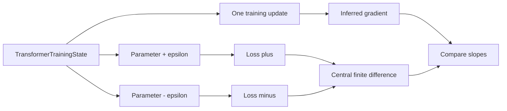

# Advanced Exercises

These exercises are for contributors extending the learning system.

Use this loop:

```text
find learner friction -> add one artifact -> add one validation signal
```

Advanced work should make the project easier to teach, not only more
mathematically impressive.

## Exercise 1: Add A Diagram-Backed Chapter Section

Pick one chapter that needs a diagram. Add the prose first, then the diagram,
then a checkpoint that asks the reader to explain the diagram in terms of Rust
types.

Pass condition:

The diagram has an adjacent explanation that names:

- the Rust values,
- the ML or software meaning,
- the category-theory relationship.

## Exercise 2: Extend The Sketches Module

Choose one concept from `book/src/seven-sketches-rust.md` that is currently
only a small model.

Extend it with:

- one new typed value
- one law-checking function or test
- one explanation paragraph in the chapter

Pass condition:

The extension includes both a positive example and one boundary case. A reader
should see what valid composition permits and what invalid structure rejects.

## Exercise 3: Improve One Exercise

Pick one exercise that feels too vague.

Rewrite it so that it includes:

- a specific file to inspect,
- a command to run,
- an expected failure or output shape,
- a short answer template.

Pass condition:

Another reader can complete the exercise without asking what to open, what to
run, or how to know whether they are finished.

## Exercise 4: Review The Attention Projection Boundary

Inspect:

```text
src/attention.rs
examples/06_attention_scores.rs
book/src/roadmap.md
```

Explain why `MultiHeadOutput -> ProjectedAttentionOutput` is modeled as a
typed morphism instead of multiplying raw vectors by a raw matrix directly in
the example.

Your answer should name:

- the invariant protected by `HeadCount`,
- the two shape checks protected by `AttentionHeadOutputs`,
- the model-dimension relationship exposed by `MultiHeadOutput`,
- the matrix and input-width checks protected by `AttentionOutputProjection`,
- the sequence-length and width checks protected by `ResidualConnection`,
- the parameter and dimension checks protected by `LayerNormalization`,
- the two-layer shape checks protected by `PositionWiseFeedForward`,
- the length and width checks protected by `PositionalEncoding`,
- the projection and shape-preservation checks protected by
  `SingleHeadTransformerBlock`,
- the head-count, value-width, and output-projection checks protected by
  `MultiHeadTransformerBlock`,
- the mask-shape checks protected by `MaskedMultiHeadTransformerBlock`,
- the readout and state checks protected by `TransformerReadout`,
  `TinyTransformerParameters`, and `TransformerTrainingState`,
- the readout-only update protected by `TransformerReadoutTrainStep`,
- the local feed-forward update protected by `TransformerFeedForwardTrainStep`,
- the composed token-loss update protected by `TransformerBlockTrainStep`,
- the richer reader-facing diagrams and direct reader feedback that still
  remain planned.

Pass condition:

The answer separates the implemented attention, residual, normalization,
feed-forward, positional-encoding, single-head, multi-head, masked-block,
structured-state, readout-only training, local feed-forward training, and
composed block-training boundaries from future reader-driven diagram and
worked-example refinements.

## Exercise 5: Explain A Finite-Difference Gradient Check

Inspect:

```text
src/attention.rs
```

Start with these tests:

```text
transformer_block_train_step_matches_finite_difference_for_readout_weight
transformer_block_train_step_matches_finite_difference_for_feed_forward_weight
transformer_block_train_step_matches_finite_difference_for_layer_norm_parameter
transformer_block_train_step_matches_finite_difference_for_attention_projection
transformer_block_train_step_matches_finite_difference_for_readout_bias
transformer_block_train_step_matches_finite_difference_for_feed_forward_bias
transformer_block_train_step_matches_finite_difference_for_output_projection_bias
transformer_block_train_step_matches_finite_difference_for_attention_projection_bias
```

Run:

```bash
cargo test finite_difference --lib
```

Explain why each test compares two views of the same local slope:

```text
inferred gradient from one training update
central finite difference of average loss
```

For a worked solution before writing your own answer, read the gradient-checking
worked example in `book/src/exercises.md`.

Use this diagram as the explanation target:



Then choose one checked parameter family and answer:

```text
Rust syntax:

ML concept:

Category theory concept:

What failure would this test catch?
```

Pass condition:

- You name the parameter family being perturbed.
- You explain why the loss is evaluated at `value + epsilon` and
  `value - epsilon`.
- You explain why the one-step update gives an inferred gradient.
- You identify at least one bug class this check would catch, such as a wrong
  sign, missing bias term, or scaling mismatch.
